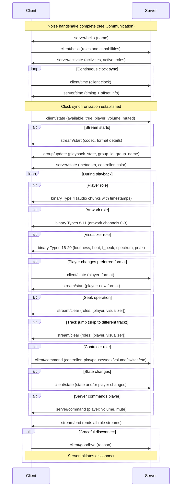
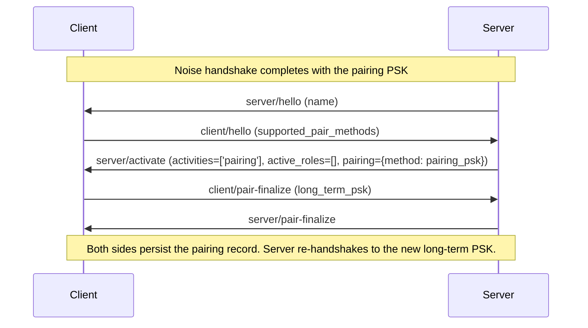
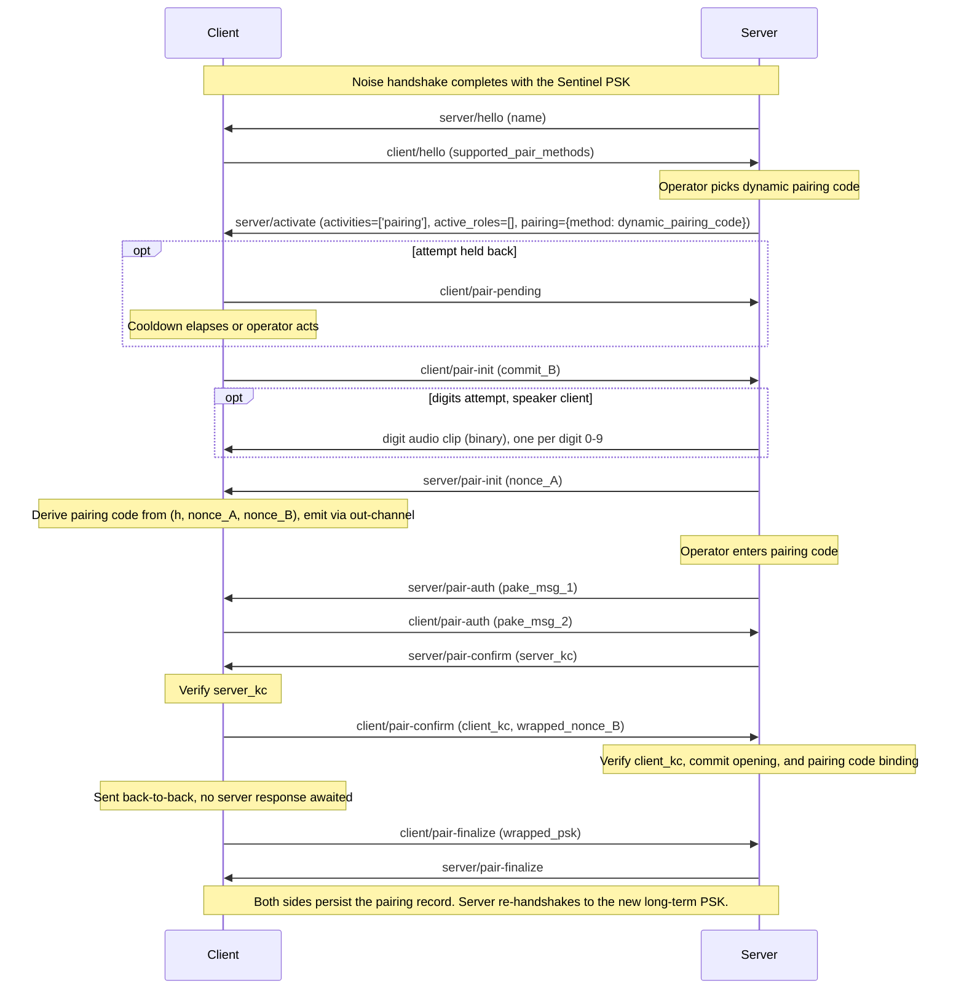
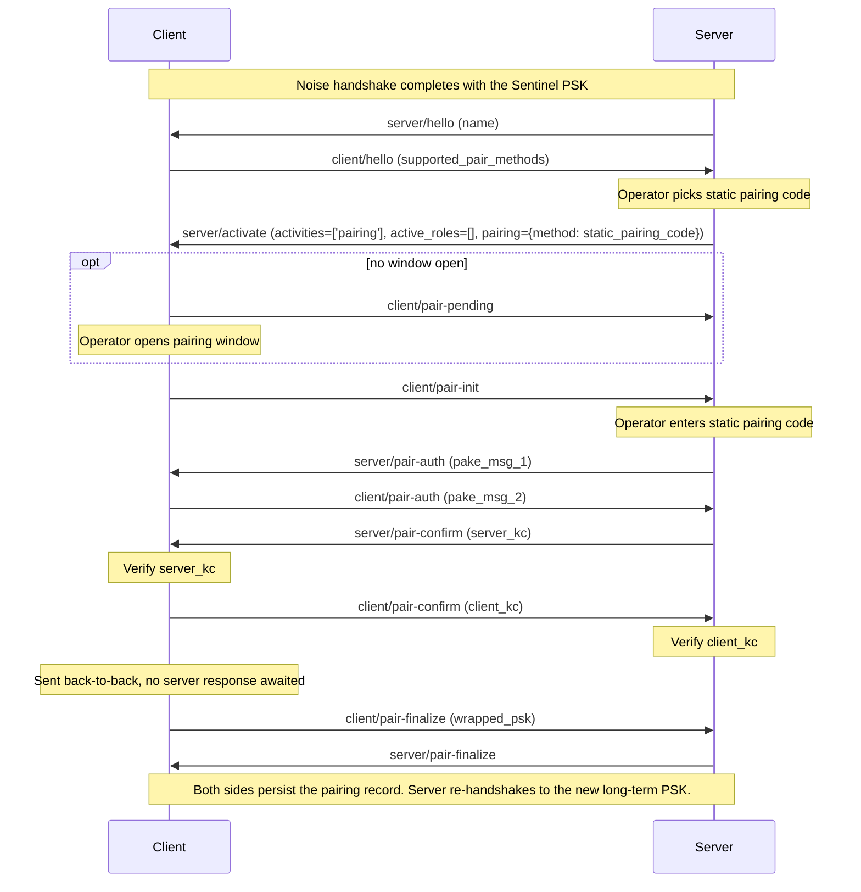

<!--
  GENERATED FILE - do not edit directly.
  README.md is generated from the split spec source .md files.
  Edit those, not this file. Enable the pre-commit hook once with
  `git config core.hooksPath .githooks` to keep README.md up to date
  automatically. See CONTRIBUTING.md for details.
-->

# The Sendspin Protocol

Sendspin is a multi-room music experience protocol. The goal of the protocol is to orchestrate all devices that make up the music listening experience. This includes outputting audio on multiple speakers simultaneously, screens and lights visualizing the audio or album art, and wall tablets providing media controls.

## Normative Language

The key words "MUST", "MUST NOT", "REQUIRED", "SHALL", "SHALL NOT", "SHOULD", "SHOULD NOT", "RECOMMENDED", "NOT RECOMMENDED", "MAY", and "OPTIONAL" in this document are to be interpreted as described in BCP 14 [RFC 2119](https://www.rfc-editor.org/rfc/rfc2119) [RFC 8174](https://www.rfc-editor.org/rfc/rfc8174).

## Protocol overview

A typical session, from handshake through playback to disconnect:



## Definitions

- **Server** - orchestrates all devices, generates audio streams, manages players and clients, provides metadata
- **Client** - a device or application that can play audio, capture audio inputs, visualize audio, display metadata, display colors, or provide music controls. Has different possible roles (player, source, metadata, controller, artwork, visualizer, color). Every client has a unique identifier
  - **Player** - receives audio and plays it in sync. Has its own volume and mute state and preferred format settings
  - **Source** - captures audio from a local input and streams it to the server
  - **Controller** - controls the group this client is part of
  - **Metadata** - displays text metadata (title, artist, album, etc.)
  - **Artwork** - displays artwork images. Has preferred format for images
  - **Visualizer** - visualizes music. Has preferred format for audio features
  - **Color** - receives colors derived from the current audio
- **Group** - a group of clients. Each client belongs to exactly one group, and every group has at least one client. Every group has a unique identifier. Each group has the following states: list of member clients, volume, mute, and playback state
- **Stream** - client-specific details on how the server is formatting and sending binary data. Each role's stream is managed separately. Each client receives its own independently encoded stream based on its capabilities and preferences. For players, the server sends audio chunks as far ahead as the client's buffer capacity allows. For artwork clients, the server sends album artwork and other visual images through the stream
- **CSPRNG** - a cryptographically secure pseudorandom number generator seeded with sufficient entropy ([RFC 4086](https://www.rfc-editor.org/rfc/rfc4086)); a hardware RNG qualifies
- **Identity** - a Curve25519 keypair used to identify a client or server in the [Noise](#encryption) handshake. The base64url-encoded public key (43 characters, no padding) serves as the `client_id` or `server_id`. Persistent across reboots. The private key MUST be drawn from a CSPRNG.
- **long-term PSK** - a 32-byte pre-shared symmetric secret established during [pairing](#pairing) and mixed into the [Noise](#encryption) handshake state for every subsequent connection. MUST be drawn from a CSPRNG.
- **pairing PSK** - a 32-byte symmetric secret used as the PSK in the [Pairing PSK method](#pairing). It is always distributed alongside the client's static public key (`client_id`), which the server needs to verify the client identity. The operator enters it into the server as a [pairing token](#pairing-token), copied as text or scanned as a QR code. Distinct from the long-term PSK that pairing produces. MUST be drawn from a CSPRNG.
- **Pairing Code** - a value used in code-based [pairing](#pairing) methods. The static-pairing-code method uses a fixed 8-digit decimal value; the dynamic-pairing-code method uses a per-session generated value, emitted as a 6-digit decimal code or as a QR code (see [Dynamic Pairing Code Flow](#dynamic-pairing-code-flow)).
- **Factory Reset** - returns a device to its manufactured state: credentials and settings the manufacturer provisioned (identity keypair, pairing PSK, static pairing code, a calibrated [output delay](#client--server-clientstate-player-object)) are restored; everything accumulated since, pairing records included, is cleared.
- **Paired Session** - a session keyed by a long-term PSK, meaning the client holds a pairing record for the server. Sessions keyed by the pairing PSK or the Sentinel PSK are *unpaired*, which limits the server to a pairing exchange, or to normal playback and control flows where [unpaired access](#unpaired-access) is enabled. Neither side sends this on the wire: both derive it from the PSK that matched during the [Noise](#encryption) handshake.

## Role Versioning

Roles define what capabilities and responsibilities a client has. All roles use explicit versioning with the `@` character: `<role>@<version>` (e.g., `player@v1`, `controller@v1`).

This specification defines the following roles: [`player`](#player-messages), [`source`](#source-messages), [`controller`](#controller-messages), [`metadata`](#metadata-messages), [`artwork`](#artwork-messages), [`visualizer`](#visualizer-messages), [`color`](#color-messages). All servers must implement all versions of these roles described in this specification.

All role names and versions not starting with `_` are reserved for future revisions of this specification.

### Priority and Activation

Clients list roles in `supported_roles` in priority order (most preferred first). If a client supports multiple versions of a role, all should be listed: `["player@v2", "player@v1"]`.

The server activates at most one version per role family (e.g., one `player@vN`, one `controller@vN`) - the first match it implements from the client's list, or none if server policy declines to activate that family. A server MUST NOT activate a role or version the client did not list in `supported_roles`. The server reports activated roles in `active_roles`; clients MUST consult it and refrain from sending commands or state for roles that aren't active.

Message object keys (e.g., `player?`, `controller?`) use unversioned role names. The server determines the appropriate version from the client's `active_roles`.

### Detecting Outdated Servers

Servers should track when clients request roles or role versions they don't implement (excluding those starting with `_`). This indicates the client supports newer role versions than the server and the server needs to be updated.

This mechanism only detects role-version skew, and only because roles are exchanged after the handshake. A newer core `version`, cipher suite, or handshake (a cipher or handshake change is itself a core `version` bump) makes the [handshake](#failure-handling) abort before roles are exchanged, so that skew surfaces as a failed connection rather than through this role-request signal.

### Application-Specific Roles

Custom roles outside the specification start with `_` (e.g., `_myapp_controller`, `_custom_display`). Application-specific roles can also be versioned: `_myapp_visualizer@v2`. To avoid collisions between independent vendors, custom role names SHOULD include a vendor-specific prefix (e.g., `_vendorname_role`).

Their binary message IDs come from the unmanaged 192-255 range: an application-specific role's own definition assigns its IDs, and a client MUST NOT advertise two roles with conflicting IDs.

## Establishing a Connection

Sendspin has two standard ways to establish connections: Server and Client initiated. Server Initiated connections are recommended as they provide standardized multi-server behavior, but require mDNS which may not be available in all environments.

Servers must support both methods described below. Clients MUST use exactly one of the two methods at a time, advertising or discovering accordingly.

The WebSocket transport MUST be plain `ws://`. Confidentiality and integrity are provided end to end by the [Noise layer](#encryption) inside the WebSocket payloads.

### Server Initiated Connections

Clients announce their presence via mDNS using:
- Service type: `_sendspin._tcp.local.`
- Port: The port the Sendspin client is listening on (recommended: `8928`)
- TXT record: `path` key specifying the WebSocket endpoint, REQUIRED (recommended value: `/sendspin`)
- TXT record: `name` key specifying the friendly name of the player (optional)

The server discovers available clients through mDNS and connects to each client via WebSocket using the advertised address and path.

The TXT `name` SHOULD match the `name` the client sends in [`client/hello`](#client--server-clienthello). It is only a discovery-time hint; if the two differ, the `client/hello` value is authoritative.

**Note:** Do not manually connect to servers if you are advertising `_sendspin._tcp`.

#### Multiple servers (server-initiated)

A client holds at most one admitted connection at a time, classified by the highest-ranked activity in its declared [`activities`](#server--client-serveractivate); from highest to lowest:

- `'playback'`
- `'pairing'`

A connection with empty `activities` ranks lowest.

Clients must persistently store the `server_id` of the server that most recently held the admitted connection while `'playback'` was among its `activities` (the "last-playback server").

When a new server connects, the client lets the handshake complete before applying admission; the new connection is provisional until its first [`server/activate`](#server--client-serveractivate) declares its priority. The incoming connection's priority is compared to the current connection's: higher or equal is accepted, lower is rejected. Two exceptions:

- A [pairing attempt](#entering-and-leaving-pairing) is not displaced by an incoming `'playback'` or `'pairing'` connection.
- When both the current holder and the incoming connection have empty `activities`, the incoming is admitted only if its `server_id` matches the last-playback server (and the existing one's does not); otherwise the existing is kept.

Subsequent `server/activate` updates do not trigger arbitration, even when a connection escalates its activities. A provisional connection that has not sent `server/activate` within 30 seconds is dropped. Clients MAY cap how many provisional connections they hold at once, rejecting further incoming connections as if they were lower priority.

A displaced connection receives [`client/goodbye`](#client--server-clientgoodbye) reason `'another_server'` (or [`pair/abort`](#client--server-pairabort) reason `concurrent_attempt` if it is a pairing handshake). A rejected incoming receives [`client/goodbye`](#client--server-clientgoodbye) reason `'concurrent_attempt'` (or [`pair/abort`](#client--server-pairabort) reason `concurrent_attempt` for pairings). The client then closes the connection.

### Client Initiated Connections

If clients prefer to initiate the connection instead of waiting for the server to connect, the server must be discoverable via mDNS using:
- Service type: `_sendspin-server._tcp.local.`
- Port: The port the Sendspin server is listening on (recommended: `8927`)
- TXT record: `path` key specifying the WebSocket endpoint, REQUIRED (recommended value: `/sendspin`)
- TXT record: `name` key specifying the friendly name of the server (optional)

Clients discover the server through mDNS and initiate a WebSocket connection using the advertised address and path.

The TXT `name` SHOULD match the `name` the server sends in [`server/hello`](#server--client-serverhello). It is only a discovery-time hint; if the two differ, the `server/hello` value is authoritative.

**Note:** Do not advertise `_sendspin._tcp` if the client plans to initiate the connection.

#### Multiple servers (client-initiated)

Unlike server-initiated connections, servers cannot reclaim clients by reconnecting. How clients handle multiple discovered servers, server selection, and switching is implementation-defined.

**Note:** After this point, Sendspin works independently of how the connection was established. The Sendspin client is always the consumer of data like audio or metadata, regardless of who initiated the connection.

## Encryption

All Sendspin connections use end-to-end encryption based on the [Noise Protocol Framework](https://noiseprotocol.org/noise.html). Encryption is mandatory for all connections established through the standard discovery mechanisms described in [Establishing a Connection](#establishing-a-connection).

### Pattern

Sendspin uses the `KKpsk2` Noise pattern. Both static keys are pre-known to both parties (the `client_id` of the client and the `server_id` of the server are the static public keys), and a [Pre-Shared Key](#pre-shared-key) is mixed in at the end of the handshake's second message.

The **server is the Noise initiator**, the **client is the Noise responder**, regardless of which side initiated the WebSocket connection.

**Security properties.** Forward secrecy is provided by the ephemeral-key DH in each handshake: compromise of static keys or the PSK does not retroactively decrypt prior sessions' transport traffic (the exception is the first handshake message's payload, recoverable with the client's static key). Replay protection is provided by Noise's per-direction transport counter; a repeated or out-of-order ciphertext fails AEAD decryption and aborts the connection.

### Cipher Suites

A suite specifies the `<DH>_<cipher>_<hash>` part of the full Noise protocol name. Sendspin defines two:

- `25519_ChaChaPoly_SHA256` - software-friendly suite
- `25519_AESGCM_SHA256` - hardware-accelerated suite (AES-NI / ARMv8 Crypto Extensions)

Servers must support both suites. Clients must support at least one.

The client picks one suite and announces it in [`client/init`](#client--server-clientinit); since servers are required to support every suite, no negotiation is needed.

### Identities

The `client_id` and `server_id` fields are the base64url-encoded (no padding) Curve25519 public keys of the client and server respectively, 43 characters each. These keys serve both as routing/persistence identifiers and as the static keys used in the Noise handshake. The private keys MUST be drawn from a [CSPRNG](#definitions) per device and MUST NOT be a fixed default shared across devices.

**Key rotation.** Each side's static keypair is intended to be long-lived; the identifier is the pubkey, so rotating the keypair changes the identity. A server that rotates its static keypair (e.g., reprovisioned hardware, migrated host, lost private key) appears to clients as a different server. Operators who want to preserve identity across server moves must preserve the server's static private key (e.g., as part of the server's backup/restore set).

### Pre-Shared Key

The PSK is mixed into the handshake state at the end of the second handshake message (the `psk2` modifier). The transport-mode keys derived after the handshake therefore include the PSK, but the first handshake message's payload (sent by the server) is encrypted without the PSK mixed in.

To let the client select the right PSK before the PSK must be mixed in, the server includes a `psk_id` and a `psk_category` in the first handshake message's payload. The identifier is a 43-character base64url-encoded value (no padding) of a 32-byte SHA-256 output, derived deterministically from the PSK:

```
psk_id = base64url(SHA-256("sendspin-psk-id-v1" || PSK))
```

The label is the UTF-8 byte sequence of the literal characters shown (no NUL terminator, no surrounding quotes); `||` denotes byte concatenation. The same formula applies to all three PSK categories (long-term, pairing, Sentinel); the client stores each of its PSKs tagged with its category. `psk_category` declares which category the server is using the referenced PSK as - `'lt'` (long-term), `'pr'` (pairing), or `'sn'` (Sentinel) - so a match binds both sides to the same category, which determines how to proceed. The single handshake pattern (`KKpsk2`) is used in all three cases; only the PSK input differs.

The **Sentinel PSK** is a published constant used as the PSK input whenever no other PSK applies. It provides no authentication on its own (its value is public); authentication, when needed, is established later during [Pairing](#pairing). The sentinel value is:

```
Sentinel PSK = SHA-256("sendspin-sentinel-psk-v1")
             = 0x1b5e24dbc1aed95fc2a5a338a90c05df44bd10f5ec1f4cd66cbf86272767b9d3
```

and its `psk_id` is therefore also a published constant:

```
Sentinel psk_id = 0x185b15f6d2da4909bd1dc156a4ab206103abef0153bcd52d926170b95cf7ce8a
                = base64url "GFsV9tLaSQm9HcFWpKsgYQOr7wFTvNUtkmFwuVz3zoo"
```

The client decrypts the first handshake message's payload (possible without a PSK, as noted above), compares the included `psk_id` to the hash of each candidate PSK of the declared `psk_category`, and selects the one that matches. It then mixes that PSK in to process the second handshake message. If no candidate matches, the client falls back to the Sentinel PSK (see [Sentinel Fallback](#sentinel-fallback)).

Each [long-term PSK](#definitions) is persisted in a [pairing record](#pairing-records) alongside the server's `server_id`. After a `psk_id` match, the client verifies that the matched PSK's stored `server_id` equals the one in [`server/init`](#server--client-serverinit); mismatch fails the handshake.

### Sentinel Fallback

A `psk_id` lookup miss means the server referenced a credential the client cannot use: the client lost its pairing record (e.g., a [Factory Reset](#definitions), [eviction](#pairing-records), or storage failure), an interrupted [pairing finalize](#server--client-serverpair-finalize) left the client without the record the server persisted, or the client holds the referenced PSK under a different category than the declared `psk_category`. On a lookup miss in the initial handshake the client completes the second handshake message with the Sentinel PSK instead of failing. The fallback applies only there: a miss during a [re-handshake](#re-handshake), and a failed stored-pubkey post-match check (a misbinding, not a miss), fail the handshake as before.

The server verifies the second handshake message against the PSK its first message referenced. If that fails and the referenced PSK was not the Sentinel, it verifies the same message against the Sentinel PSK before treating the handshake as failed. A second message that validates under the Sentinel is an authenticated **credential-mismatch signal**: the handshake authenticates the client's static key, so the signal proves its holder could not use the referenced PSK. The signal alone MUST NOT cause either side to remove or replace a record.

The session proceeds as an ordinary [unpaired](#definitions) Sentinel connection, except that the server MUST NOT activate roles or declare the `'playback'` activity while its pairing record exists - the session carries a [pairing](#pairing) exchange or stays idle. The server SHOULD surface the mismatch to its operator and offer re-pairing, which replaces the record and restores normal service.

### Prologue

The prologue mixed into the Noise handshake state on both sides is the concatenation of the exact bytes of [`client/init`](#client--server-clientinit) followed by the exact bytes of [`server/init`](#server--client-serverinit), as transmitted on the wire (the JSON-encoded UTF-8 message body, without the WebSocket framing). This binds the cleartext init exchange to the handshake; tampering causes the handshake to fail.

Both sides MUST hash the raw message bytes exactly as sent and received, not a re-encoding of the parsed message.

### Failure Handling

Any handshake-phase failure - malformed cleartext message, unsupported `version`, unknown `suite`, handshake timeout, a `psk_id` lookup miss without the [Sentinel Fallback](#sentinel-fallback), Noise AEAD failure, or AEAD failure once in transport mode - closes the WebSocket without sending any application-level error message. Implementations SHOULD apply a timeout (e.g., 30 seconds) for each side to receive the next expected message during the prologue and Noise-handshake phases.

### Re-handshake

The server may rerun the Noise handshake in transport mode to swap session keys without closing the WebSocket - typically to promote the session to paired after a successful [pairing](#pairing), to switch from Sentinel to a pairing PSK, or to rotate session keys on long-running connections.

The server initiates, as in the original handshake. The two [`noise/handshake`](#client--server-noisehandshake) messages are sent as encrypted binary frames inside the current channel; `psk_id` and `psk_category` in noise message 1 select the PSK for the new session. `client/init` and `server/init` are not re-sent - `client_id`, `server_id`, and `suite` carry over. The new handshake's prologue is the prior handshake's hash `h`. No other messages flow during the exchange; once the new keys are in place, the connection continues with the usual [`server/hello`](#server--client-serverhello) → [`client/hello`](#client--server-clienthello) → [`server/activate`](#server--client-serveractivate).

## Communication

Once the WebSocket connection is established, Client and Server perform an initial handshake before exchanging application data:

1. Client → Server: [`client/init`](#client--server-clientinit) (cleartext)
2. Server → Client: [`server/init`](#server--client-serverinit) (cleartext)
3. Server → Client: [`noise/handshake`](#client--server-noisehandshake) - Noise message 1 (cleartext)
4. Client → Server: [`noise/handshake`](#client--server-noisehandshake) - Noise message 2 (cleartext)
5. Both sides switch to Noise transport mode. From this point, all Sendspin application data is sent as WebSocket binary frames whose payloads are Noise transport ciphertexts.
6. Server → Client: [`server/hello`](#server--client-serverhello) (encrypted)
7. Client → Server: [`client/hello`](#client--server-clienthello) (encrypted)
8. Server → Client: [`server/activate`](#server--client-serveractivate) (encrypted)

No other messages should be sent before the initial [`server/activate`](#server--client-serveractivate) arrives, except possibly [`client/goodbye`](#client--server-clientgoodbye). See [Encryption](#encryption) for cryptographic details.

Cleartext handshake messages (`client/init`, `server/init`, `noise/handshake`) are sent as WebSocket **text** frames containing JSON. After the encrypted channel is established, all messages are sent as WebSocket **binary** frames carrying Noise transport ciphertexts.

WebSocket control frames (Ping, Pong, Close; RFC 6455) are not Sendspin messages: they remain valid at any time, are not encrypted at the Noise layer, and Ping/Pong is the expected connection-liveness mechanism.

**Note:** In field definitions, `?` indicates an optional field (e.g., `field?`: type means the field may be omitted).

All messages have a `type` field identifying the message and a `payload` object containing message-specific data. The payload structure varies by message type and is detailed in each message section below.

**Message type prefixes.** The prefix before the `/` in a message `type` identifies a group of messages. `client/` and `server/` name the sender. `stream/` groups the messages that control a binary channel from the server to the client, and `client-stream/` those that control a binary channel from the client to the server; the two kinds of channel are independent and have separate lifetimes. `group/`, `pair/`, and `noise/` name a subject. Only `client/`, `server/`, and `client-stream/` imply a direction; for every other prefix each message's definition gives it.

**Forward compatibility.** Clients and servers MUST ignore unrecognized `payload` fields (keys not defined for the message) rather than treating them as an error. Clients and servers MUST NOT send fields the specification does not define for the message, other than the `_`-prefixed [application-specific role](#application-specific-roles) objects a message explicitly permits.

Message format example:

```json
{
  "type": "stream/start",
  "payload": {
    "server_transmitted": 1234567890,
    "player": {
      "codec": "opus",
      "sample_rate": 48000,
      "channels": 2,
      "bit_depth": 16
    },
    "artwork": {
      "channels": [
        {
          "source": "album",
          "format": "jpeg",
          "width": 800,
          "height": 800
        }
      ]
    }
  }
}
```

WebSocket binary messages are used to send JSON payloads, audio chunks, media art, and visualization data. Each binary message is a Noise transport ciphertext; after AEAD decryption, the first byte is a uint8 representing the message type. Throughout this specification, bit 0 refers to the least significant bit.

### Binary Message ID Structure

The first byte of every binary message is its message ID. IDs are assigned from the table below; each role's binary message definitions name the exact IDs it uses.

| IDs | Assignment |
|---|---|
| 0 | JSON message body (UTF-8) |
| 1 | [Fragmentation](#fragmentation) |
| 2 | [Pairing](#server--client-digit-audio-clip-binary) |
| 3 | Reserved for future use |
| 4-7 | Player role |
| 8-11 | Artwork role |
| 12-15 | Source role |
| 16-23 | Visualizer role |
| 24-191 | Reserved for future roles |
| 192-255 | Available for use by [application-specific roles](#application-specific-roles) |

Future roles will be allocated aligned blocks of 4 or 8 IDs from the reserved 24-191 range.

**Note:** Role versions share the same binary message IDs (e.g., `player@v1` and `player@v2` both use IDs 4-7).

### Fragmentation

A single Noise transport message is limited to 65535 bytes by the Noise specification. Both defined cipher suites use a 16-byte AEAD authentication tag, and the message type byte occupies the first byte of the AEAD plaintext, so the application payload per frame is at most 65535 − 16 − 1 = 65518 bytes. Larger messages must be split across multiple WebSocket binary frames using the fragment message type.

**Wire format** (inside the AEAD-protected plaintext of each fragment frame):

- First fragment: `[1][flags][orig_type][data]`
- Subsequent fragments: `[1][flags][data]`

`flags` is a uint8. Bit 1 is set on the first fragment of a message and bit 0 on the last. Bits 2-7 are reserved and MUST be zero.

The concatenated `data` from all fragments yields the original message's payload (the bytes that would have followed the message type byte in a non-fragmented message of type `orig_type`).

**Constraints:**

- Only one fragmented message may be in flight at a time per direction. A sender must finish a fragmented message with a last fragment before sending any other frame in that direction, whether fragmented or not.
- Senders should not fragment messages that fit in a single non-fragmented frame.
- A sender MUST NOT use `1` as `orig_type`.

**Receiver behavior:** maintain a single reassembly buffer along with the in-flight `orig_type`. On a first fragment, read `orig_type` from byte 2 and start a new buffer with the rest of the frame; on any other fragment, append the frame's data to the buffer. When bit 0 is set, dispatch the buffer as a single message of type `orig_type` and clear it.

**Malformed sequences** are protocol errors; the receiver MUST close the connection. They are: a first fragment received while a fragmented message is in flight, a non-first fragment received with none in flight, a non-fragment frame received while a fragmented message is in flight, a nonzero reserved flag bit, and an `orig_type` of `1`.

## Clock Synchronization

Clients send `client/time` messages to maintain an accurate offset from the server's clock. Implementations MUST send these messages frequently enough to keep the filter convergent. The time-filter library's [Recommended Usage](https://github.com/Sendspin-Protocol/time-filter#recommended-usage) section describes a known-good burst-strategy baseline.

Binary audio messages contain timestamps in the server's time domain indicating when the audio should be played. Clients MUST use the [time-filter](https://github.com/Sendspin-Protocol/time-filter) algorithm to translate server timestamps to their local clock for synchronized playback. The time filter is a two-dimensional Kalman filter that tracks both clock offset and drift. See the [time-filter](https://github.com/Sendspin-Protocol/time-filter) repository for a C++ reference implementation and [aiosendspin](https://github.com/Sendspin-Protocol/aiosendspin/blob/main/aiosendspin/client/time_sync.py) for a Python implementation.

Each [`server/time`](#server--client-servertime) response provides the four timestamps needed by the filter: the client's transmitted timestamp, the server's received timestamp, the server's transmitted timestamp, and the client's receive time (captured locally when the response arrives). Clients feed these into the time filter via its `update` method and use its `compute_client_time` method to convert server timestamps to local clock values for playback scheduling.

A player MUST NOT report `available: true` until its time filter has converged enough to begin scheduling playback. A source MUST NOT report `available: true` until its time filter has converged enough to timestamp captured audio.

### Transmit timestamps

Two things report when the server transmitted a message: the `server_transmitted` field, and the `send_ahead` interval carried in binary audio chunks. The server takes this time as late as its implementation permits, after any application-level queueing or per-client scheduling, immediately before the message is encrypted for transmission. A server MUST NOT stamp a message at the time it is enqueued for later transmission.

Delay accruing after that point - transport send buffering, an earlier fragmented message still in flight, link contention - is not represented in the value and is observed by the client as network delay.

A client measuring transit takes its `arrival` time for the message once the message is available to the application: after AEAD decryption, and after reassembly for a fragmented message. Both ends of the measurement therefore sit at the application boundary.

## Core messages
This section describes the fundamental messages that establish communication between clients and the server. These messages handle initial handshakes, ongoing clock synchronization, stream lifecycle management, and role-based state updates and commands.

Every client and server must implement all messages in this section regardless of their specific roles. Role-specific object details are documented in their respective role sections and need to be implemented only if the client supports that role.

[Pairing](#pairing) messages are required for all servers; clients implement the subset matching their advertised pairing methods.

### Client → Server: `client/init`

First message sent by the client after the WebSocket connection is established. Contains information necessary for conducting the Noise handshake.

- `client_id`: string - client's static public key (43-character base64url-encoded Curve25519, no padding). See [Identities](#identities). Persistent across reconnections so servers can associate clients with previous sessions (e.g., remembering group membership, settings, playback queue)
- `version`: integer (must be `1`) - version of the core message format that the client implements (independent of role versions)
- `suite`: '25519_ChaChaPoly_SHA256' | '25519_AESGCM_SHA256' - Noise cipher suite the client picked for this connection. See [Cipher Suites](#cipher-suites)

**Note:** `version` (here and in [`server/init`](#server--client-serverinit)) is an exact-match field naming the single core message format the sender speaks, not a minimum-supported version. Under this specification both sides send `1` and abort the handshake on any other value (see [Failure Handling](#failure-handling)); a future revision that changes the core format will bump the value and define its own negotiation semantics.

### Server → Client: `server/init`

Response to the [`client/init`](#client--server-clientinit) message with corresponding information about the server.

The server sends `server/init` immediately followed by the first [`noise/handshake`](#client--server-noisehandshake) message (Noise message 1) without waiting for any client message in between.

- `server_id`: string - server's static public key (43-character base64url-encoded Curve25519, no padding). See [Identities](#identities)
- `version`: integer (must be `1`) - version of the core message format that the server implements (independent of role versions)

### Client ↔ Server: `noise/handshake`

Carries one Noise handshake message. Sent twice during the handshake: once by the server (Noise message 1, sent immediately after [`server/init`](#server--client-serverinit)), and once by the client in response (Noise message 2).

- `data`: string - base64url-encoded Noise handshake message bytes (no padding)

The encrypted payload carried inside each Noise handshake message is a UTF-8 JSON object:

- **Noise message 1 payload** (server → client): 
  - `psk_id`: string - 43-character base64url-encoded SHA-256 hash derived from the PSK. Used by the client to select the PSK before processing message 2; the message-1 payload is decryptable without the PSK (see [Pre-Shared Key](#pre-shared-key)).
  - `psk_category`: 'lt' | 'pr' | 'sn' - the category the server is using the referenced PSK as: long-term, pairing, or Sentinel. A `psk_id` the client holds only under a different category is a lookup miss (see [Pre-Shared Key](#pre-shared-key)). The codes share one length, so the encrypted payload's length is independent of the category.
- **Noise message 2 payload** (client → server): the empty object as the literal two bytes `{}` (not a zero-length Noise payload)

A malformed inner handshake payload (not valid UTF-8 JSON of the shape above) is a handshake failure and closes the WebSocket (see [Failure Handling](#failure-handling)).

After both handshake messages have been exchanged, both sides switch to Noise transport mode (all subsequent messages travel as the binary Noise-ciphertext frames described above).

The same `noise/handshake` message is used for the in-band [re-handshake](#re-handshake): the two messages then travel as ordinary encrypted JSON messages (binary frames, message type `0`), not bare Noise bytes. Noise message 2 is still encrypted under the pre-re-handshake transport keys; the first frame each side sends after the handshake completes uses the new keys.

### Server → Client: `server/hello`

First message sent by the server after the Noise handshake completes. Sent as an encrypted message (binary frame, message type `0`).

- `name`: string - friendly name of the server
- `languages?`: string[] - non-empty list of [BCP 47](https://www.rfc-editor.org/info/bcp47) language tags in descending operator preference (e.g. `["ca", "es", "en"]`) - a hint about the languages the operator understands, informing any operator-facing output

### Client → Server: `client/hello`

Sent by the client once it has received [`server/hello`](#server--client-serverhello). Sent as an encrypted message (binary frame, message type `0`). Contains information about the client's capabilities and roles.

Players that can output audio should have the role `player`.

- `name`: string - friendly name of the client
- `device_info?`: object - optional information about the device
  - `product_name?`: string - device model/product name
  - `manufacturer?`: string - device manufacturer name
  - `software_version?`: string - software version of the client (not the Sendspin version)
  - `mac_address?`: string - MAC address of the network interface the connection is opened on, in lowercase colon-separated form (e.g., `aa:bb:cc:dd:ee:ff`)
- `supported_roles`: string[] - versioned roles supported by the client (e.g., `player@v1`, `controller@v1`). Defined versioned roles are:
  - `player@v1` - outputs audio
  - `source@v1` - captures audio from a local input and streams it to the server
  - `controller@v1` - controls the current group
  - `metadata@v1` - displays text metadata describing the currently playing audio
  - `artwork@v1` - displays artwork images
  - `visualizer@v1` - visualizes audio
  - `color@v1` - receives colors derived from the current audio
- `player@v1_support?`: object - required if `player@v1` is listed, absent otherwise ([see player@v1 support object details](#client--server-clienthello-playerv1-support-object))
- `source@v1_support?`: object - required if `source@v1` is listed, absent otherwise ([see source@v1 support object details](#client--server-clienthello-sourcev1-support-object))
- `visualizer@v1_support?`: object - required if `visualizer@v1` is listed, absent otherwise ([see visualizer@v1 support object details](#client--server-clienthello-visualizerv1-support-object))
- `supported_pair_methods`: object - pairing methods this client currently offers, keyed by method identifier, each value a [pair-method descriptor](#client--server-clienthello-pair-method-descriptor). Every client offers at least the Pairing PSK method, and at most one pairing-code method may be listed (see [Pairing](#pairing)).
- `unpaired_access`: object - whether this client currently admits [unpaired access](#unpaired-access)
  - `enabled`: boolean

**Note:** Each role version may have its own support object (e.g., `player@v1_support`, `player@v2_support`). Application-specific roles or role versions follow the same pattern (e.g., `_myapp_display@v1_support`, `player@_experimental_support`).

A server MUST NOT activate a role version that was listed in `supported_roles` without its support object.

### Server → Client: `server/activate`

Declares the server's current purpose on this connection. Sent as an encrypted message (binary frame, message type `0`). May be re-sent any time to change the activity set.

- `activities`: ('playback' | 'pairing')[] - the set of currently-active purposes on this connection. May be empty. Members are unordered and unique.
- `active_roles?`: string[] - versioned roles that are active for this client (e.g., `player@v1`, `controller@v1`). Required on the first `server/activate`; persists across subsequent `server/activate` messages that omit it. MUST be empty on connections not capable of playback (see below). A client treats a first `server/activate` that omits it as carrying an empty `active_roles`.
- `pairing?`: object - parameters of the pairing attempt this activation admits. Required when `'pairing'` is in `activities`; absent otherwise. A client ignores this field when `activities` does not include `'pairing'`.
  - `method`: 'dynamic_pairing_code' | 'pairing_psk' | 'static_pairing_code' - pairing method the server picked, drawn from the client's `supported_pair_methods`.
  - `format?`: 'digits' | 'qr_code' - the dynamic [emission format](#dynamic-pairing-code-flow), drawn from the client's `dynamic_pairing_code` descriptor. Required when `method` is `'dynamic_pairing_code'`; absent otherwise. The server selects `qr_code` only when its operator interface can scan a QR code, and - for a client whose descriptor carries `digit_audio` - `digits` only when it can fit the digit audio pack, in the format of the client's `digit_audio`, within its `max_bytes`.

The activity sets the server may legitimately declare are constrained by which PSK matched during the [Noise handshake](#encryption):

| PSK matched | Allowed activity sets |
|---|---|
| [long-term PSK](#definitions) | `[]` or `['playback']` |
| [pairing PSK](#definitions) | `['pairing']` |
| [Sentinel PSK](#pre-shared-key) | `[]`, `['pairing']`, `['playback']`¹ |

¹ `['playback']` on the Sentinel PSK is only allowed when the client has [unpaired access](#unpaired-access) enabled.

`pairing.method` MUST be `'pairing_psk'` if and only if the matched PSK is the [pairing PSK](#definitions). It MUST also be a method present in the client's [`supported_pair_methods`](#client--server-clienthello).

**Playback-capable connections.** A connection is *playback-capable* when its `activities` extended with `'playback'` are an allowed set for the matched PSK; a connection already declaring `'playback'` is therefore playback-capable exactly when its `activities` are an allowed set. Only a playback-capable connection MAY carry a non-empty `active_roles`, and it may do so even when `'playback'` is not currently in `activities`. The client re-evaluates this constraint on every `server/activate` against the persisted `active_roles`: if a later activation changes `activities` so the connection is no longer playback-capable without explicitly sending `active_roles`, the persisted roles are treated as empty rather than the message rejected.

`server/activate` is *admissible* when it satisfies the constraints above. When one is not admissible, the client rejects it, selecting the response by the first rule that applies:

- If the matched PSK is the [Sentinel PSK](#pre-shared-key), the client does not have [unpaired access](#unpaired-access) enabled, and enabling unpaired access would make the activation admissible - close the connection with [`client/goodbye`](#client--server-clientgoodbye) reason `'pairing_required'`.
- If `activities` is not an allowed set for the matched PSK, or `active_roles` is non-empty on a connection that is not playback-capable - close the connection with [`client/goodbye`](#client--server-clientgoodbye) reason `'unauthorized'`.
- If `'pairing'` is in `activities` with a `pairing.method` the matched PSK disallows or the client does not currently offer, or a `pairing.format` the client does not currently offer - reply with [`pair/abort`](#client--server-pairabort) reason `method_not_supported`, leaving the connection open.

**Worked example (`pairing_required` vs `unauthorized`).** A Sentinel-keyed connection to a client with unpaired access disabled receives `activities: ['playback']` and `active_roles: ['player@v1']`. Under a hypothetical `unpaired_access: enabled`, `['playback']` would be an allowed set for the Sentinel PSK and the connection would be playback-capable, so the activation would be admissible: the client closes with `'pairing_required'`. If the same connection instead received `activities: ['pairing']` with `active_roles: ['player@v1']`, no unpaired-access setting makes a pairing connection playback-capable, so the reason is `'unauthorized'`.

Servers SHOULD declare the minimal set of activities that reflects the connection's current purpose, and drop an activity as soon as that purpose ends. Admission between competing connections is decided by the highest-ranked declared activity (see [Multiple servers](#multiple-servers-server-initiated)), so keeping an unused activity declared would degrade multi-server cooperation.

Servers normally activate the client's [preferred](#priority-and-activation) version of each role, but MAY omit a role at their discretion (e.g., based on whether the session is paired, deployment context, or operator policy). Checking `active_roles` is therefore required to determine what the client may actually use on this session.

When a `server/activate` removes a role from `active_roles`, the server MUST first end that role's output by sending [`stream/end`](#server--client-streamend) for stream roles (`player`, `artwork`, `visualizer`), or a [`server/state`](#server--client-serverstate) with a null role object for state roles (`metadata`, `color`, `controller`) - so the client never holds live data for an inactive role.

### Client → Server: `client/time`

Sends current internal clock timestamp (in microseconds) to the server.
Once received, the server responds with a [`server/time`](#server--client-servertime) message containing timing information to establish clock offsets.

- `client_transmitted`: integer - client's internal clock timestamp in microseconds

### Server → Client: `server/time`

Response to the [`client/time`](#client--server-clienttime) message with timestamps to establish clock offsets.

For synchronization, all timing is relative to the server's monotonic clock. These timestamps have microsecond precision and are not necessarily based on epoch time.

- `client_transmitted`: integer - client's internal clock timestamp received in the `client/time` message
- `server_received`: integer - timestamp that the server received the `client/time` message in microseconds
- `server_transmitted`: integer - timestamp that the server transmitted this message in microseconds

### Client → Server: `client/state`

Client sends state updates to the server. Contains client-level state and role-specific state objects.

Sent once the client is ready to report its operational status (`available`), and whenever any state changes thereafter. A player reports `available: true` only after it has established [clock synchronization](#clock-synchronization). When a role becomes active in `active_roles`, the client MUST send an update that includes that role's object. The server MUST NOT send a role's binary data until it has received that object. For a role that defines no state object, the client's initial `client/state` opens its binary data instead.

A client whose `active_roles` are non-empty sends the initial `client/state` even when none of its roles defines a state object.

Every message MUST carry `available` and the full state of each role object it includes. Omitting a role object leaves that role's state unchanged.

- `available`: boolean - whether the client is available to participate in Sendspin playback
  - `true` - client is operational and ready to participate in playback; for a player or source this means its clock is synchronized with the server.
  - `false` - client's output is in use by an external system and is not currently participating in Sendspin playback with this server. See [External Source Handling](#external-source-handling)
- `player?`: object - only if client has `player` role ([see player state object details](#client--server-clientstate-player-object))
- `source?`: object - only if client has `source` role ([see source state object details](#client--server-clientstate-source-object))
- `artwork?`: object - only if client has `artwork` role ([see artwork state object details](#client--server-clientstate-artwork-object))
- `visualizer?`: object - only if client has `visualizer` role ([see visualizer state object details](#client--server-clientstate-visualizer-object))

[Application-specific roles](#application-specific-roles) may also include objects in this message (keys starting with `_`).

### External Source Handling

A client's output can be taken over by a non-Sendspin activity (playing other media, another protocol, an HDMI input, and so on). How it reports this depends on whether it will still yield its output back to Sendspin on request.

#### Interruptible activity (client stays available)

If the external activity can be interrupted by Sendspin playback at any time, the client SHOULD remain `available: true` so the server can take it over.

To stop rendering its group's audio while performing non-Sendspin activity, a client MAY leave its current group by sending a `client/state` with `available: false` immediately followed by a `client/state` with `available: true` (the server behavior below then moves it to a solo group and does not rejoin it). This is only needed while the group's `playback_state` is `'playing'`.

#### Non-interruptible activity (client becomes unavailable)

When a client reports `available: false`, it indicates the client's output is in use by an external system (e.g., a different audio source, HDMI input, or local media playback) and will not participate in Sendspin playback with this server until it returns to `available: true`.

A client SHOULD report `available: false` only while it will not yield its output to Sendspin, and SHOULD return to `available: true` as soon as it is again willing to be taken over.

#### Server behavior when a client becomes unavailable (`available: false`):

If the client is in a multi-client group:
1. Remember the client's current group as its "previous group" (see [switch command cycle](#switch-command-cycle))
2. Move the client to a new solo group (stopped)
   - Send [`group/update`](#server--client-groupupdate) with the new group information
   - Send [`stream/end`](#server--client-streamend) for all active streams

If the client is already in a solo group:
- Stop playback and send [`stream/end`](#server--client-streamend) for all active streams
- If `playback_state` was not already `'stopped'`, send [`group/update`](#server--client-groupupdate) reporting `playback_state: 'stopped'`

When a client returns to `available: true`, the server MUST NOT auto-rejoin it to its previous group or restart playback; the client remains in the solo group and rejoins only via an explicit [`switch`](#switch-command-cycle).

### Client → Server: `client/command`

Client sends commands to the server. Contains command objects based on the client's supported roles.

- `controller?`: object - only if client has `controller` role ([see controller command object details](#client--server-clientcommand-controller-object))

[Application-specific roles](#application-specific-roles) may also include objects in this message (keys starting with `_`).

### Server → Client: `server/state`

Server sends state updates to the client. Contains role-specific state objects.

Every message MUST carry the full state of each role object it includes. Omitting a role object leaves that role's state unchanged and any pending scheduled update in place. For the `metadata` and `color` objects, a future `timestamp` defers when the state takes effect (see scheduled updates for [`metadata`](#scheduled-metadata-updates) and [`color`](#scheduled-color-updates)).

The first `server/state` sent for a role on a connection, and the first after that role is re-added to `active_roles`, MUST carry a past or present `timestamp` if the role object has one, so the client is brought up to date before any scheduled update follows.

A role object set to `null` clears all of that role's state, taking effect immediately and discarding any pending scheduled update.

- `metadata?`: object | null - only sent to clients with `metadata` role ([see metadata state object details](#server--client-serverstate-metadata-object))
- `controller?`: object | null - only sent to clients with `controller` role ([see controller state object details](#server--client-serverstate-controller-object))
- `color?`: object | null - only sent to clients with `color` role ([see color state object details](#server--client-serverstate-color-object))

[Application-specific roles](#application-specific-roles) may also include objects in this message (keys starting with `_`).

### Server → Client: `server/command`

Server sends commands to the client. Contains role-specific command objects.

- `player?`: object - only sent to clients with `player` role ([see player command object details](#server--client-servercommand-player-object))
- `source?`: object - only sent to clients with `source` role ([see source command object details](#server--client-servercommand-source-object))

[Application-specific roles](#application-specific-roles) may also include objects in this message (keys starting with `_`).

### Server → Client: `stream/start`

Starts a stream for one or more roles. If sent for a role that already has an active stream, updates the stream configuration without clearing buffers. If a parameter change requires rebuffering (e.g., a sample rate change), the receiver handles this internally: it does not clear buffers unless its implementation requires it, and may document its specific behavior.

- `server_transmitted`: integer - timestamp that the server transmitted this message in microseconds
- `player?`: object - only sent to clients with the `player` role ([see player object details](#server--client-streamstart-player-object))
- `artwork?`: object - only sent to clients with the `artwork` role ([see artwork object details](#server--client-streamstart-artwork-object))
- `visualizer?`: object - only sent to clients with the `visualizer` role ([see visualizer object details](#server--client-streamstart-visualizer-object))

[Application-specific roles](#application-specific-roles) may also include objects in this message (keys starting with `_`).

The server MUST NOT send `stream/start` to a client that is not [`available`](#client--server-clientstate) (e.g. a client whose output is taken by an [external source](#external-source-handling)).

Each role's stream configuration is derived from what the client reports about itself: the role's support object in [`client/hello`](#client--server-clienthello) for constant capabilities, and the role's [`client/state`](#client--server-clientstate) object for the stream-configuration fields the client may change during the connection (each role may define both). After a role is added or re-added to `active_roles`, the server MUST wait for the [`client/state`](#client--server-clientstate) update the activation requires before starting that role's stream, so it does not start from stale state. When a `client/state` changes a role's stream-configuration fields while a stream is active for that role, the server re-derives the stream configuration and, if it changed, sends a `stream/start` with the new configuration. When no stream is active for the role, the server MUST NOT start one in response; the updated state applies to the next stream it starts for that role.

**Note:** Clients may change their stream-configuration fields to adapt to changing network conditions, CPU constraints, or display requirements. The server maintains separate encoding for each client, allowing heterogeneous device capabilities within the same group.

### Server → Client: `stream/clear`

Instructs clients to clear buffers without ending the stream. Used for seek operations and track jumps (switching to a different track without stopping the stream).

- `server_transmitted`: integer - timestamp that the server transmitted this message in microseconds
- `roles?`: string[] - which roles to clear: '[player](#server--client-streamclear-player)', '[visualizer](#server--client-streamclear-visualizer)', or both. If omitted, clears both roles

[Application-specific roles](#application-specific-roles) may also be included in this array (names starting with `_`).

### Server → Client: `stream/end`

Ends the stream for one or more roles. When received, clients should stop output and clear buffers for the specified roles. This message is expected to be sent when playback is over and the queue is empty. Specifically:

- **Track transitions** (a track ends and the next begins naturally): no stream commands should be sent. The stream continues uninterrupted to support gapless playback and server-inserted crossfade.
- **Seeks** (jumping to a position within the current track): send `stream/clear` instead.
- **Track jumps** (skipping to a different track): treat identically to a seek, sending `stream/clear` instead of `stream/end`. Conceptually, the entire queue is a single continuous stream.

Sending `stream/end` in these cases is explicitly prohibited because it signals actual playback termination, causing clients to stop output entirely rather than continue playing.

- `roles?`: string[] - roles to end streams for ('player', 'artwork', 'visualizer'). If omitted, ends all active streams

[Application-specific roles](#application-specific-roles) may also be included in this array (names starting with `_`).

### Server → Client: `group/update`

State update of the group this client is part of.

Every message MUST carry the full group state.

- `playback_state`: 'playing' | 'stopped' - playback state of the group
- `group_id`: string - group identifier
- `group_name`: string - friendly name of the group

### Server → Client: `server/unpair`

Sent by a paired server to drop its own pairing record from the client. Valid at any time regardless of the current `activities`. No payload fields.

Client behavior:

- Remove the matched pairing record, send [`client/goodbye`](#client--server-clientgoodbye) reason `'unpaired'`, and close the connection.
- If the session is [unpaired](#definitions), there is no record to remove, so ignore the message and continue unchanged.

### Client → Server: `client/goodbye`

Sent by the client before gracefully closing the connection. This allows the client to inform the server why it is disconnecting.

Upon receiving this message, the server should initiate the disconnect.

- `reason`: 'another_server' | 'shutdown' | 'restart' | 'user_request' | 'unauthorized' | 'pairing_required' | 'concurrent_attempt' | 'unpaired'
  - `another_server` - client is switching to a different server. A client that leaves one server for another MUST send this reason to the server it is leaving. Server SHOULD NOT auto-reconnect but SHOULD show the client as available for future playback
  - `shutdown` - client is shutting down. When the device is powering off or otherwise not coming back and no more specific reason applies, clients SHOULD send this reason. Server should not auto-reconnect
  - `restart` - client is restarting and will reconnect. Server should auto-reconnect
  - `user_request` - user explicitly requested to disconnect from this server. Server should not auto-reconnect
  - `unauthorized` - the server declared an activity set or `active_roles` the client is not authorized for (see [`server/activate`](#server--client-serveractivate)). Server should not auto-reconnect with the same activity set
  - `pairing_required` - the client refused, or no longer admits, an [unpaired access](#unpaired-access) connection because it does not have unpaired access enabled. Server should not auto-reconnect without pairing first
  - `concurrent_attempt` - the client refused the connection because a higher-or-equal-priority connection is already active (e.g., one with `'playback'` in its activity set, or a pairing handshake when the incoming connection is also pairing). Server may retry later
  - `unpaired` - the client has processed [`server/unpair`](#server--client-serverunpair) from this server. Server should not auto-reconnect

**Note:** On a client-initiated connection the server cannot reconnect; the reconnect guidance then applies to the client re-establishing the connection.

Clients may close the connection without sending this message (e.g., crash, network loss), or immediately after sending `client/goodbye` without waiting for the server to disconnect. When a client disconnects without sending `client/goodbye`:

- On a connection whose `activities` are empty, or include `'playback'`, servers should assume the disconnect reason is `restart` and attempt to auto-reconnect.
- Otherwise, servers should treat the drop as a session termination and not auto-reconnect; resumption, if desired, is operator-driven.
- Servers should also apply backoff on repeated Noise-handshake failures to avoid tight reconnect loops. After repeated consecutive failures, the server SHOULD stop auto-reconnecting until there is reason to expect success (e.g., the client re-announces via mDNS or network conditions change).

## Pairing

Pairing is the one-time setup that mutually authenticates a client and a server. The pairing flow uses the same WebSocket endpoint and [`KKpsk2`](#encryption) Noise pattern as every other connection; only the PSK fed into the handshake and the client's post-handshake routing differ (see [Pre-Shared Key](#pre-shared-key)). After any successful pairing both sides persist the new pairing record, then the server initiates an in-band [re-handshake](#re-handshake) to the newly delivered `long_term_psk`, promoting the channel to a paired session without closing the WebSocket.

This specification defines three pairing methods. Servers must implement all three; clients must implement Pairing PSK and may additionally offer at most one pairing-code method: Static Pairing Code or Dynamic Pairing Code.

### Methods

1. **Pairing PSK** - pairing authenticated by a [pairing PSK](#definitions); no PAKE round, no pairing code. See [Pairing PSK Flow](#pairing-psk-flow).
2. **Dynamic Pairing Code** - pairing with a per-session [Pairing Code](#definitions) that the client derives from a commit-and-reveal binding to the Noise handshake and emits via an out-channel (display, speaker, etc.) for the operator to enter into the server. See [Dynamic Pairing Code Flow](#dynamic-pairing-code-flow).
3. **Static Pairing Code** - pairing with a fixed [Pairing Code](#definitions). Appropriate for devices with no out-channel; vulnerable to MITM if the pairing code is disclosed. See [Static Pairing Code Flow](#static-pairing-code-flow).

A code-based pairing runs over a Sentinel-keyed connection: the channel is unauthenticated until the [PAKE](#pake) round completes. The round establishes trust from scratch and produces a new [long-term PSK](#definitions).

The client reveals the new long-term PSK only after `server_kc` verifies, and only as `wrapped_psk` [sealed under the CPace output](#wrapping): a peer that cannot complete the PAKE - wrong pairing code, or a man in the middle relaying between two handshakes, whose differing `h` gives each leg a different `sid` - neither triggers the reveal nor can unwrap it.

Static pairing methods (Pairing PSK, Static Pairing Code) do not take over the device's out-channel. Dynamic pairing (Dynamic Pairing Code) takes over the out-channel - typically the audio output or display - to emit the per-session pairing code, so it cannot run while audio is playing on the same device; the operator must stop playback before initiating pairing (see [Multiple servers](#multiple-servers-server-initiated)).

Clients with a usable out-channel (display, speaker, etc.) should offer `dynamic_pairing_code` rather than `static_pairing_code`, which is intended for devices without one. Clients whose display can render a QR code should also offer the `qr_code` [emission format](#dynamic-pairing-code-flow).

### Pairing Records

Each successful pairing produces a pairing record: the new [long-term PSK](#definitions) persisted together with the server's `server_id`. The client MUST persist the new record, replacing any record it already holds for the server.

A client MUST be able to store at least 5 pairing records; more is allowed. When a pairing completes at capacity, the client MUST evict an existing record so that the new record persists - a pairing never fails for lack of record storage. Which record is evicted is implementation-defined (for example, the least recently used), except that the client MUST NOT evict a record backing a currently-open connection, provisional or admitted; the client MUST cap its concurrently open paired connections below its record capacity (see [Multiple servers](#multiple-servers-server-initiated)) so an evictable record always exists.

Eviction needs no wire signal. An evicted server's next handshake references a `psk_id` the client no longer holds and lands in the [Sentinel Fallback](#sentinel-fallback): the server receives an authenticated credential-mismatch signal and can offer its operator re-pairing.

### Entering and leaving pairing

Pairing and playback are mutually exclusive on a connection. When a server moves an established connection into pairing it first quiesces the client's streams - sending [`stream/end`](#server--client-streamend) for active stream roles and a [`server/state`](#server--client-serverstate) with null role objects for state roles, as when a role is removed from `active_roles` - and then sends the pairing [`server/activate`](#server--client-serveractivate) with empty `active_roles`. The quiesce is stream-only: unlike an [`available: false`](#external-source-handling) transition, the client keeps its group membership and queued group state through the pairing activity - no move to a solo group, no previous-group memory, no bar on resuming in place.

Each pairing `server/activate` admits one **pairing attempt**, in progress from its first pairing message - [`client/pair-init`](#client--server-clientpair-init) (pairing-code methods) or [`client/pair-finalize`](#client--server-clientpair-finalize) (Pairing PSK) - until success or [`pair/abort`](#client--server-pairabort). [`client/pair-pending`](#client--server-clientpair-pending) precedes an attempt and does not start it. The client bounds each attempt with an **attempt timeout** measured from its first message (recommended 2 minutes); on expiry it sends `pair/abort` with reason `attempt_timeout`.

The `server/activate` that ends the pairing transition declares the connection's resulting `activities` and reactivates roles via `active_roles`.

The same `server/activate` can also end a pairing attempt without finalizing: sent in place of [`server/pair-finalize`](#server--client-serverpair-finalize), it persists nothing and discards any received PSK. A client that, after sending [`client/pair-finalize`](#client--server-clientpair-finalize), receives `server/activate` likewise persists nothing.

After leaving pairing, a server silently discards pairing messages still in flight from the client - messages sent before the client observed the leave `server/activate`. A client that has aborted an attempt likewise silently discards pairing messages received before the next `server/activate`.

A server MAY send such a cancelling `server/activate` at any point during a pairing attempt. On receipt the client abandons the attempt, discarding all pairing state, and proceeds under the declared activities; an abandoned attempt does not count against a [pairing window](#pairing-window), and counts as a [failed attempt](#failed-attempts) only when the code was already being emitted. A server cancelling on operator action SHOULD first send [`pair/abort`](#client--server-pairabort) with reason `user_cancelled`, so the client can surface why the attempt ended. Servers SHOULD apply their own timeout while waiting for the attempt's first pairing message - [`client/pair-init`](#client--server-clientpair-init) or, in the Pairing PSK Flow, [`client/pair-finalize`](#client--server-clientpair-finalize) - cancelling as above on expiry.

### Unpaired Access

A client MAY admit a server with no pairing record to activate roles or declare the `'playback'` activity. The session is [unpaired](#definitions). Whether a client admits unpaired access is governed by its `unpaired_access` setting: the default is the manufacturer's choice, changing it is a local client action (manufacturer-defined), and the current value is advertised in [`client/hello`](#client--server-clienthello) as `unpaired_access.enabled`. A client that stops admitting unpaired access closes any connection relying on it with [`client/goodbye`](#client--server-clientgoodbye) reason `'pairing_required'`.

On the server side, unpaired access is gated by **operator approval**, granted per [`client_id`](#definitions): a server MUST NOT declare `'playback'` or activate roles on a Sentinel-keyed connection to a client its operator has not approved. The operator grants approval through a dedicated approval control. A server MAY also take an operator action that clearly means to use the client, such as starting playback on it, as implied approval. Approval SHOULD persist, MUST be revocable by the operator, and MUST be discarded on a successful pairing. There is no wire flag on the server's side: it extends unpaired access simply by activating roles or declaring `'playback'` in [`server/activate`](#server--client-serveractivate). The server MAY hold the connection at empty `activities`, ready to activate roles once approved, or to enter pairing.

While a client is unapproved, the server SHOULD identify and present it to the operator. When presenting clients, a server MUST clearly distinguish those that are neither paired nor approved from those that are, so a new client claiming a familiar name cannot pass for an existing device. When an unapproved client offers pairing, the server MUST present it as a clearly available action for that client. For an approved client, pairing SHOULD stay available as an upgrade.

**Security.** Unpaired connections are vulnerable to **man-in-the-middle attacks**. The Sentinel PSK is a published constant, and in the unpaired case neither peer's static key is bound to its identity by any authenticated out-of-band exchange; an attacker on the local network may therefore impersonate either side. The Noise handshake still provides confidentiality and replay protection for the session itself, but offers no assurance about which peer it was established with.

### Pairing PSK Flow

The Noise handshake completes using the pairing PSK, authenticating both sides. The client proceeds straight to [`client/pair-finalize`](#client--server-clientpair-finalize).

**Lifecycle.** The client's pairing PSK MUST be drawn from a [CSPRNG](#definitions) per device and MUST NOT be a fixed default shared across devices, whether provisioned at manufacture or generated by the client. It persists across reboots and is per-client and long-lived: a successful pairing does not consume it (pairing produces a separate [long-term PSK](#definitions)), so it can pair the client with any number of servers.



If a connection is already open under any other PSK - Sentinel or a [long-term PSK](#definitions) - when the operator picks `pairing_psk`, the server first [re-handshakes](#re-handshake) to the pairing PSK before sending the `server/activate` shown above.

Two standing client obligations follow from this flow:

1. The client MUST keep its pairing PSK among its handshake PSK candidates at all times, not only while a pairing activity is running: the server's re-handshake to the pairing PSK succeeds only if the client already recognizes its `psk_id`.
2. Before sending [`client/pair-finalize`](#client--server-clientpair-finalize), the client MUST verify that the connection's matched PSK is the pairing PSK (the receiving side of the `pairing.method` invariant in [`server/activate`](#server--client-serveractivate)); on mismatch it aborts with [`pair/abort`](#client--server-pairabort) reason `method_not_supported`.

**Pairing Token.** A server needs both the [pairing PSK](#definitions) and the client's static public key to select and verify the client's Noise identity. The two are distributed together in a version-0 [pairing token](#pairing-token):

```
payload = client_key (32 bytes) || pairing_psk (32 bytes)
```

- `client_key` - the raw 32-byte Curve25519 public key whose base64url form is the [`client_id`](#identities).
- `pairing_psk` - the raw 32-byte [pairing PSK](#definitions).

The operator enters the token into the server to begin the flow. The pairing PSK MUST be exposed as the token, not the bare PSK. Before pairing, the server MUST confirm the decoded `client_key` matches the `client_id` presented on the connection.

The reference vector for `client_key = 0x00 0x01 … 0x1f` and `pairing_psk = 0xe0 0xe1 … 0xff`:

```
SP:0AAAQEAYEAUDAOCAJBIFQYDIOB4IBCEQTCQKRMFYYDENBWHA5DYP6BYPC4PSOLZXH5DU6V97M5XXO74HR6LZ7J5PW674PT6X37T6757Y
```

### Dynamic Pairing Code Flow

Pairing with a per-session pairing code derived from the Noise handshake and emitted by the client via its out-channel, in one of two **emission formats** (the activation's [`format`](#server--client-serveractivate)): `digits` - a decimal code the operator types into the server - or `qr_code` - a code rendered as a QR code that the operator scans into the server. Either way, a [PAKE](#pake) round authenticates both sides. An attempt may be [held back](#failed-attempts) before it starts.



**Binding values.** The Dynamic Pairing Code Flow introduces three values across two messages that bind the pairing code to the underlying Noise handshake:

- `nonce_A` - 32 bytes drawn from a [CSPRNG](#definitions) by the server, sent in [`server/pair-init`](#server--client-serverpair-init), base64url-encoded (43 chars).
- `nonce_B` - 32 bytes drawn from a [CSPRNG](#definitions) by the client, kept private until [`client/pair-confirm`](#client--server-clientpair-confirm) reveals it as `wrapped_nonce_B`, [sealed under the CPace output](#wrapping).
- `commit_B` - `SHA-256("sendspin-pair-commit-v1" || nonce_B)`, sent by the client in [`client/pair-init`](#client--server-clientpair-init) before any value from the server is known (32 bytes base64url-encoded, 43 chars). Locks the client's contribution to the pairing code derivation.

**Pairing code derivation.** Both formats derive the pairing code from the same digest of the Noise handshake hash `h` and the two nonces:

```
digest   = SHA-256("sendspin-pairing-code-derive-v1" || h || nonce_A || nonce_B)

digits:   code_int = uint256_be(digest) mod 10^6
          code     = decimal(code_int) zero-padded to 6 digits
qr_code:  code     = digest[0..23]
```

The hash input is the UTF-8 bytes of the literal label `"sendspin-pairing-code-derive-v1"` (no separator, no NUL terminator) followed by `h` (32 bytes, raw), `nonce_A` (32 bytes, raw), and `nonce_B` (32 bytes, raw). In the `digits` format the full 32-byte SHA-256 output is interpreted as an unsigned big-endian 256-bit integer and reduced modulo 10^6, zero-padded on the left to exactly 6 ASCII digits. The pairing code bytes fed into CPace as `PRS` are these 6 ASCII digits - the same per-digit encoding as the static pairing code. In the `qr_code` format the pairing code is binary - the first 24 bytes of the digest - and the code bytes fed into CPace as `PRS` are these 24 raw bytes.

**Digits emission.** A client that displays the pairing code follows [Pairing Code Presentation](#pairing-code-presentation). A client that speaks it reads single digits in the [presentation groups](#pairing-code-presentation); it SHOULD leave a short gap between digits and a longer one between groups. The digits themselves come from a **digit audio pack** supplied by the server: ten mono clips, one recording of each decimal digit `0`-`9`, trimmed to the spoken digit, in a language of the server's choosing.

**Digit audio pack.** A speaker client advertises the pack it wants as `digit_audio` in its [`dynamic_pairing_code` descriptor](#client--server-clienthello-pair-method-descriptor) - the format it accepts and `max_bytes`, the largest encoded pack size it accepts. Servers MUST be able to supply the pack in any such format: all three codecs, at any sample rate and bit depth. In a `digits` attempt, after [`client/pair-init`](#client--server-clientpair-init) the server delivers the clips as [digit audio clip](#server--client-digit-audio-clip-binary) messages in ascending digit order, each at most 2 seconds of audio and together at most `max_bytes` encoded. [`server/pair-init`](#server--client-serverpair-init) then completes the pack. The client emits by playing the clip for each code digit in turn. The pack is presentation-only - clips never enter the derivation or `PRS` - and is discarded when the attempt ends. The client verifies each clip as it arrives, before any is played. A clip over 2 seconds, a pack over `max_bytes`, a clip undecodable or whose embedded stream parameters contradict the client's format, or a pack still incomplete when `server/pair-init` arrives is a [protocol error](#protocol-errors).

In initial pairing the pack comes from an unauthenticated peer, which thereby chooses what the client's speaker plays. The clip constraints keep each clip short, and the peer, unable to predict the code, cannot choose which clips play or in what order, so they cannot be strung into a longer message.

**QR-code emission.** In the `qr_code` format the client presents the pairing code as a version-1 [pairing token](#pairing-token) with the 24-byte code as its payload (39 body characters), rendered as a QR code on its display. The server applies the token [decoding](#pairing-token) rules to operator input; the first 24 payload bytes are the entered pairing code.

The reference vector for `code = 0xe0 0xe1 … 0xf7`:

```
SP:14DQ6FY7E4XTOP9HJ5LV6Z3PO57YPD4XT6T97N5Y
```

**Client verification.** On receipt of [`server/pair-confirm`](#server--client-serverpair-confirm), the client verifies the CPace MCF tag `server_kc`. On failure the client sends [`pair/abort`](#client--server-pairabort) with reason `pairing_code_mismatch`.

**Server verification.** When [`client/pair-confirm`](#client--server-clientpair-confirm) arrives, the server verifies, in this order:

1. CPace MCF tag `client_kc`
2. `wrapped_nonce_B` [unwraps](#wrapping) to a `nonce_B` with `SHA-256("sendspin-pair-commit-v1" || nonce_B) == commit_B`
3. `derived_code(h, nonce_A, nonce_B) == code_entered`

A failed key confirmation results in [`pair/abort`](#client--server-pairabort) with reason `pairing_code_mismatch`. A `wrapped_nonce_B` that fails to decrypt, a recovered `nonce_B` that does not match `commit_B`, or an entered code that fails the binding check is a [protocol error](#protocol-errors). Any failure discards the received `wrapped_psk`. Only when all three checks pass does the server process [`client/pair-finalize`](#client--server-clientpair-finalize), [unwrapping](#wrapping) the PSK.

#### Failed attempts

An attempt counts as failed once the client has started emitting the code and the attempt ends without a successful verification of `server_kc`. After 20 consecutive failed attempts the client MUST hold attempts back until a deliberate, manufacturer-defined operator action. The count is not partitioned by `server_id` or source address and resets on a successful verification or on that action. A client MAY hold attempts back earlier, by a cooldown or by an operator action, including from the first attempt.

The limit is not an error state - the method stays offered - and while it holds an attempt back the client sends [`client/pair-pending`](#client--server-clientpair-pending), optionally saying in `message` what it waits for.

### Static Pairing Code Flow

Pairing with a fixed pairing code. The operator types it into the server, where a [PAKE](#pake) round authenticates both sides. Every attempt is gesture-gated by a [pairing window](#pairing-window).

**Lifecycle.** The static pairing code is a fixed 8-digit value. A factory-provisioned pairing code MUST be drawn uniformly at random from a [CSPRNG](#definitions) per device and MUST NOT be a fixed default shared across devices; a shared default would let anyone pair with any such device.



**Client verification.** On receipt of [`server/pair-confirm`](#server--client-serverpair-confirm), the client verifies the CPace MCF tag `server_kc`. On failure the client sends [`pair/abort`](#client--server-pairabort) with reason `pairing_code_mismatch`.

**Server verification.** When [`client/pair-confirm`](#client--server-clientpair-confirm) arrives, the server verifies the CPace MCF tag `client_kc` before processing [`client/pair-finalize`](#client--server-clientpair-finalize). On failure the server sends [`pair/abort`](#client--server-pairabort) with reason `pairing_code_mismatch` and discards the received `wrapped_psk`. On success it processes `client/pair-finalize`, [unwrapping](#wrapping) the PSK.

#### Pairing Window

The Static Pairing Code Flow gates every attempt on a **pairing window**: a state in which the client has decided to accept pairing attempts. The window admits up to **5** attempts, all on the connection that carries its first, and closes on a completed pairing, its fifth failed attempt (the client's verification of `server_kc` fails), drop of that connection, operator cancellation, or window-lifetime expiry. An attempt that ends any other way - timed out or cancelled - only ends that attempt; the window stays open for another.

An attempt is **gesture-gated** - the client withholds [`client/pair-init`](#client--server-clientpair-init) until a window is open - for every `static_pairing_code` attempt.

Pairing Window mechanics:

- **Opening the window.** An operator gesture on the client - a physical button press, a reset-pinhole press, a button combo, a specific power-cycle pattern, a shake or motion gesture, or any equivalent implementation-defined action. Gestures SHOULD be deliberate and hard to induce remotely.
- **Window lifetime.** From window opening, paused while an attempt is in progress. Recommended 5 minutes. On expiry, the window closes silently.
- **Signal to the server.** The client sends [`client/pair-init`](#client--server-clientpair-init) once the window is open and the [`server/activate`](#server--client-serveractivate) has arrived; while a gesture is awaited it signals [`client/pair-pending`](#client--server-clientpair-pending), optionally naming the gesture in `message`. The server must not send [`server/pair-auth`](#server--client-serverpair-auth) until it has received `client/pair-init`.

### Pairing Code Presentation

Grouping is presentation-only: the pairing code value is the contiguous digits, and separators never enter derivation, entry, or `PRS`. The 6-digit dynamic pairing code SHOULD be presented grouped `3-3`, the 8-digit static pairing code `4-4`, with a hyphen between groups (`123-456`, `1234-5678`). Servers SHOULD present matching grouped entry that makes the expected length evident (e.g. one slot per digit) and SHOULD strip separator characters (spaces, hyphens) from typed input.

### Pairing Token

A **pairing token** is a single case-insensitive ASCII string carrying a pairing secret, which the operator transfers out of band (copy/paste, QR scan) from the client into the server. A token is a fixed `SP:` prefix, a version, and a base32-encoded body:

```
token = "SP:" || version || body
```

- `version` - a single alphanumeric character selecting the payload the body carries. This document defines version `0` - a [pairing PSK with the client identity](#pairing-psk-flow) - and version `1` - a per-session [dynamic pairing code](#dynamic-pairing-code-flow) in the `qr_code` emission format.

A payload becomes `body` by:

1. base32-encoding it per [RFC 4648](https://www.rfc-editor.org/rfc/rfc4648#section-6) (alphabet `A–Z`, `2–7`),
2. stripping the `=` padding, then
3. transliterating every `2` to `9`.

Tokens are drawn only from the QR code alphanumeric set (`0–9`, `A–Z`, `:`), so they render as compact QR codes and survive manual transcription. A QR code carries the token string verbatim, with no URI scheme or wrapper, so a scan and a copy/paste yield identical input.

Decoding reverses the transform and MUST be lenient with operator-supplied input:

1. Trim surrounding whitespace and upper-case it.
2. If present, strip a leading `SP:`. The first character is the `version`; reject an unrecognized version. An interface expecting a specific version rejects the others.
3. Transliterate every `9` back to `2`, re-pad with `=` to a multiple of 8 characters, and base32-decode into the payload.

A decoder MUST reject malformed input, including a payload shorter than its version defines. Payload bytes beyond those the version defines are reserved for future extension: a decoder MUST ignore them.

### PAKE

The code-based pairing flows use **CPACE-X25519-SHA512** as the PAKE construction, defined in [draft-irtf-cfrg-cpace-21](https://datatracker.ietf.org/doc/draft-irtf-cfrg-cpace/21/). The protocol runs in initiator-responder mode with explicit Mutual Confirmation Flow (MCF). The server takes role `A` (initiator); the client takes role `B` (responder).

Sendspin instantiates CPace's inputs as follows:

- `PRS` - the pairing code as a byte string: the literal decimal digits as UTF-8 (e.g., `0x31 0x32 0x33 0x34 0x35 0x36 0x37 0x38` for the pairing code `"12345678"`), or in the `qr_code` emission format the raw 24-byte code.
- `sid` - the UTF-8 bytes `"sendspin-pair-pake-v1"` || `h` || `counter`. `h` is the Noise handshake hash (32 bytes, raw) available immediately after Noise transport mode begins; `counter` is the number of pairing [`server/activate`](#server--client-serveractivate) messages sent since the last Noise handshake, encoded as a big-endian uint32 (4 bytes).
- `CI` - empty.
- `ADa` - the UTF-8 bytes `"server"`.
- `ADb` - the UTF-8 bytes `"client"`.

The four pairing message fields carry the corresponding CPace values, base64url-encoded without padding:

| Sendspin field | Carried in | CPace value | Bytes | base64url length |
|---|---|---|---|---|
| `pake_msg_1` | [`server/pair-auth`](#server--client-serverpair-auth) | `Ya` (server's public share) | 32 | 43 |
| `pake_msg_2` | [`client/pair-auth`](#client--server-clientpair-auth) | `Yb` (client's public share) | 32 | 43 |
| `server_kc` | [`server/pair-confirm`](#server--client-serverpair-confirm) | `Ta` (server's MCF tag, HMAC-SHA-512) | 64 | 86 |
| `client_kc` | [`client/pair-confirm`](#client--server-clientpair-confirm) | `Tb` (client's MCF tag, HMAC-SHA-512) | 64 | 86 |

### Wrapping

In the code-based flows, two values cross the wire only sealed under the CPace output: the new long-term PSK, carried as `wrapped_psk` in [`client/pair-finalize`](#client--server-clientpair-finalize), and - in the Dynamic Pairing Code Flow - the commitment opening `nonce_B`, carried as `wrapped_nonce_B` in [`client/pair-confirm`](#client--server-clientpair-confirm). Both sides derive a key per field:

```
K_wrap = SHA-256(label || sid || ISK)
```

with `label` `"sendspin-pair-psk-wrap-v1"` for `wrapped_psk` and `"sendspin-pair-nonce-wrap-v1"` for `wrapped_nonce_B`. The hash input is the UTF-8 bytes of the literal label (no separator, no NUL terminator) followed by `sid` (the CPace session id defined in [PAKE](#pake), raw) and `ISK` (the 64-byte CPace intermediate session key, raw). To wrap, the client encrypts the 32-byte value with the AEAD of the connection's negotiated [cipher suite](#cipher-suites), key `K_wrap`, a 12-byte all-zero nonce, and empty associated data; the field carries the 48-byte ciphertext-plus-tag, base64url-encoded without padding (64 chars). To unwrap, the server decrypts with the same AEAD, key, and nonce, recovering the 32-byte value.

### Protocol Errors

A condition during pairing that no conformant peer produces - a malformed or missing field, a CPace share with the wrong length or encoding a low-order point, a revealed nonce that does not match its commitment, an entered code that fails the binding check, a `wrapped_nonce_B` or `wrapped_psk` that fails to decrypt, a malformed digit audio pack - is a **protocol error**: the detecting side closes the WebSocket without sending any application-level error message, and persists nothing.

### Client → Server: `client/hello` pair-method descriptor

`supported_pair_methods` in [`client/hello`](#client--server-clienthello) is an object keyed by pairing method identifier. Each value is a descriptor object that advertises the kind of operator interaction the client expects so the server can render appropriate UX.

A client MUST NOT list both `static_pairing_code` and `dynamic_pairing_code` (see [Methods](#methods)). A server that nevertheless receives both MUST disregard the `static_pairing_code` descriptor and proceed as if only `dynamic_pairing_code` were advertised, so a non-conformant advertisement degrades to the safer method rather than to undefined behavior.

- `pairing_psk?`: object
  - `locations?`: ('device' | 'leaflet' | 'operator')[]
- `static_pairing_code?`: object
  - `locations?`: ('device' | 'leaflet' | 'operator')[]
- `dynamic_pairing_code?`: object
  - `out_channels`: ('display' | 'speaker')[] - the channels through which the per-session pairing code is conveyed to the operator.
  - `formats`: ('digits' | 'qr_code')[] - the [emission formats](#dynamic-pairing-code-flow) the client offers. Non-empty; `qr_code` requires a display able to render a QR code.
  - `digit_audio?`: object - the server-supplied [digit audio pack](#dynamic-pairing-code-flow) the client wants. Required when `out_channels` includes `'speaker'`, absent otherwise.
    - `codec`: 'opus' | 'flac' | 'pcm' - codec identifier
    - `sample_rate`: integer - sample rate in Hz (e.g., 16000)
    - `bit_depth`: integer - bit depth (e.g., 16); meaningful for `pcm` and `flac` only, ignored for `opus`
    - `max_bytes`: integer - maximum total encoded size of the ten clips in bytes

`locations` is an informational hint listing where the operator can find the method's configured secret: printed on the device, on a leaflet in the box, or set by the operator. A printed pairing PSK MUST be rendered as a QR code of its [pairing token](#pairing-token).

A server MUST ignore a key it does not recognize - leaving its value unvalidated - and select only among the rest. It MUST likewise ignore unrecognized `formats`, `out_channels`, and `locations` values, treating a `dynamic_pairing_code` left with no recognized format or no recognized channel as an unrecognized key; an unrecognized `digit_audio.codec` is treated as `'speaker'` being absent. Identifiers not defined here are reserved for future revisions of this specification. As with [unimplemented roles](#detecting-outdated-servers), servers should track ignored identifiers: they indicate the client speaks a newer revision than the server.

### Messages

The pairing messages below are listed in the order they appear in the Dynamic Pairing Code Flow (the most complete sequence), except the binary [digit audio clip](#server--client-digit-audio-clip-binary), which comes last. The Static Pairing Code Flow omits the [`server/pair-init`](#server--client-serverpair-init) message and the `commit_B` / `wrapped_nonce_B` fields; the Pairing PSK Flow additionally omits all `pair-pending`, `pair-init`, `pair-auth`, and `pair-confirm` messages.

**Sequence violations.** A pairing message that is out of sequence for the selected method and current state - and not covered by the silent-discard rules in [Entering and leaving pairing](#entering-and-leaving-pairing) - is a [protocol error](#protocol-errors).

**Pairing index.** [`client/pair-pending`](#client--server-clientpair-pending) and [`client/pair-init`](#client--server-clientpair-init) carry a `pairing_index` - the number of pairing [`server/activate`](#server--client-serveractivate) messages received since the last Noise handshake. A value lower than the server's own count is a leftover from a superseded pairing and is discarded silently; a higher value is a [protocol error](#protocol-errors).

#### Client → Server: `client/pair-pending`

Reports that the client is holding back the selected attempt: no [pairing window](#pairing-window) is open, or its [attempt limit](#failed-attempts) has not admitted it yet. Sent immediately on receiving such a pairing [`server/activate`](#server--client-serveractivate); [`client/pair-init`](#client--server-clientpair-init) follows once the client is ready. Does not start the [attempt](#entering-and-leaving-pairing) or its timeout. The server SHOULD surface the pending state and any `message` to the operator and apply its own timeout (see [Entering and leaving pairing](#entering-and-leaving-pairing)).

- `pairing_index`: integer - see [Pairing index](#messages)
- `message?`: string - a short plain-text sentence for the operator, at most 200 characters, such as what to do to proceed, preferably in one of the server's [`languages`](#server--client-serverhello). It comes from an unauthenticated peer: the server shows it as text attributed to the device, truncates it to that length, and MUST NOT interpret markup or links in it

#### Client → Server: `client/pair-init`

Starts the code-based pairing [attempt](#entering-and-leaving-pairing). Sent once the pairing [`server/activate`](#server--client-serveractivate) has arrived and the client is not [holding the attempt back](#client--server-clientpair-pending). The server must not send [`server/pair-auth`](#server--client-serverpair-auth) (static pairing code) or [`server/pair-init`](#server--client-serverpair-init) and the [digit audio clips](#server--client-digit-audio-clip-binary) (dynamic pairing code) before receiving this message.

- `pairing_index`: integer - see [Pairing index](#messages); only a match starts the attempt
- `commit_B?`: string - `SHA-256("sendspin-pair-commit-v1" || nonce_B)` (32 bytes base64url-encoded, 43 chars). Required in the [Dynamic Pairing Code Flow](#dynamic-pairing-code-flow); absent in the [Static Pairing Code Flow](#static-pairing-code-flow).

#### Server → Client: `server/pair-init`

Server's nonce contribution in the [Dynamic Pairing Code Flow](#dynamic-pairing-code-flow). Sent in response to [`client/pair-init`](#client--server-clientpair-init).

- `nonce_A`: string - 32 bytes drawn from a [CSPRNG](#definitions), base64url-encoded (43 chars). See [Dynamic Pairing Code Flow](#dynamic-pairing-code-flow)

In a `digits` attempt with a speaker client, this message follows the ten [digit audio clips](#server--client-digit-audio-clip-binary) and completes the pack. Upon receipt, the client derives and emits the pairing code; the operator then types or scans it into the server.

#### Server → Client: `server/pair-auth`

Server's CPace public share. Sent once the server has both received [`client/pair-init`](#client--server-clientpair-init) and obtained the pairing code from the operator. In the Static Pairing Code Flow the pairing code is available to the operator from the start; in the Dynamic Pairing Code Flow the client emits it after [`server/pair-init`](#server--client-serverpair-init).

- `pake_msg_1`: string - server's CPace public share `Ya` (32 bytes base64url-encoded, 43 chars). See [PAKE](#pake)

#### Client → Server: `client/pair-auth`

Client's CPace public share, sent in response to [`server/pair-auth`](#server--client-serverpair-auth).

- `pake_msg_2`: string - client's CPace public share `Yb` (32 bytes base64url-encoded, 43 chars). See [PAKE](#pake)

#### Server → Client: `server/pair-confirm`

Server's MCF tag, sent after the server has derived its CPace session key from `Yb`.

- `server_kc`: string - server's MCF tag `Ta` (64 bytes base64url-encoded, 86 chars). See [PAKE](#pake)

On receipt, the client verifies `server_kc` before sending [`client/pair-confirm`](#client--server-clientpair-confirm); see [Dynamic Pairing Code Flow](#dynamic-pairing-code-flow) / [Static Pairing Code Flow](#static-pairing-code-flow).

#### Client → Server: `client/pair-confirm`

Client's MCF tag, plus (in the Dynamic Pairing Code Flow) the sealed opening of the earlier commitment. In code-based pairing, the client sends [`client/pair-finalize`](#client--server-clientpair-finalize) immediately after this message without waiting for a server response.

- `client_kc`: string - client's MCF tag `Tb` (64 bytes base64url-encoded, 86 chars). See [PAKE](#pake)
- `wrapped_nonce_B?`: string - 48-byte [wrapping](#wrapping) of the preimage of `commit_B` sent earlier in [`client/pair-init`](#client--server-clientpair-init), base64url-encoded (64 chars). Present only in the [Dynamic Pairing Code Flow](#dynamic-pairing-code-flow).

On receipt, the server verifies before processing [`client/pair-finalize`](#client--server-clientpair-finalize); see [Dynamic Pairing Code Flow](#dynamic-pairing-code-flow) / [Static Pairing Code Flow](#static-pairing-code-flow).

#### Client → Server: `client/pair-finalize`

Delivers the long-term PSK established by this pairing. In flows that include a PAKE round, this message is sent immediately after [`client/pair-confirm`](#client--server-clientpair-confirm) without waiting for a server response, and carries the PSK [wrapped](#wrapping) under the CPace output. In the [Pairing PSK Flow](#pairing-psk-flow), it starts the pairing [attempt](#entering-and-leaving-pairing) and is sent immediately after the [`server/activate`](#server--client-serveractivate), carrying the PSK directly. Exactly one of the two fields is present.

- `long_term_psk?`: string - 43-character base64url-encoded 32-byte [long-term PSK](#definitions) (no padding). [Pairing PSK Flow](#pairing-psk-flow) only
- `wrapped_psk?`: string - 64-character base64url-encoded 48-byte [wrapping](#wrapping) of the new [long-term PSK](#definitions) (no padding). Code-based flows only

#### Server → Client: `server/pair-finalize`

Acknowledges that the server has persisted the pairing record. After receiving this message, the client persists its own record.

- payload: `{}`

#### Client ↔ Server: `pair/abort`

Aborts a pairing attempt, started or not. With reason `concurrent_attempt` the sender closes the connection after sending, otherwise the connection stays open. A `pair/abort` received after the receiver has itself ended the attempt has no effect.

- `reason`: string - one of:
  - `attempt_timeout` (client) - the pairing attempt did not complete within the [attempt timeout](#entering-and-leaving-pairing)
  - `concurrent_attempt` (client) - another pairing attempt is already in progress with this client
  - `method_not_supported` (client) - the server's activity set and `pairing.method` are not a permitted combination for the matched PSK, or `pairing.method` names a method the client does not currently offer, or `pairing.format` names an emission format the client does not currently offer
  - `pairing_code_mismatch` (client or server) - PAKE key-confirmation failed
  - `user_cancelled` (client or server) - operator aborted the pairing through a local UI

#### Server → Client: Digit Audio Clip (Binary)

One clip of a [digit audio pack](#dynamic-pairing-code-flow).

Sent only in a `digits` attempt with a speaker client, after [`client/pair-init`](#client--server-clientpair-init) and before [`server/pair-init`](#server--client-serverpair-init): ten messages in ascending digit order, together at most the descriptor's [`max_bytes`](#client--server-clienthello-pair-method-descriptor). A clip outside that window, out of order, duplicated, or with a digit above 9 is a [sequence violation](#messages).

- Byte 0: message type `2` (uint8)
- Byte 1: digit (uint8) - the decimal digit `0`-`9` the clip speaks
- Rest of bytes: the clip in the client's format

**Clip contents:** Each clip carries one whole spoken digit - mono, at most 2 seconds - in the format of the client's descriptor [`digit_audio`](#client--server-clienthello-pair-method-descriptor); a clip whose embedded stream parameters contradict it - a FLAC STREAMINFO with other channels, sample rate, or bit depth, an OpusHead with other channels - is malformed. Per codec:

- `pcm`: samples encoded as little-endian signed integers (two's complement), 24-bit samples packed as 3 bytes per sample.
- `flac`: a complete FLAC stream - `fLaC` marker, STREAMINFO block, frames.
- `opus`: an [Ogg Opus](https://www.rfc-editor.org/rfc/rfc7845) stream.

## Player messages
This section describes messages specific to clients with the `player` role, which handle audio output and synchronized playback. Player clients receive timestamped audio data, manage their own volume and mute state, and can change their preferred audio format based on their capabilities and current conditions.

Volume values (0-100) represent perceived loudness, not linear amplitude (e.g., volume 50 should be perceived as half as loud as volume 100). Clients SHOULD convert volume to a linear amplitude (the gain applied to samples, where 1.0 is full scale and 0 is silent) as `amplitude = (volume / 100)^1.5`. To avoid audible clicks, clients SHOULD apply volume changes over a short ramp.

`volume` and `muted` are independent: a volume change (via [`server/command`](#server--client-servercommand) or a group volume command) MUST NOT clear the mute state.

### Client → Server: `client/hello` player@v1 support object

The `player@v1_support` object in [`client/hello`](#client--server-clienthello) has this structure:

- `player@v1_support`: object
  - `supported_formats`: object[] - list of supported audio formats in priority order (first is preferred)
    - `codec`: 'opus' | 'flac' | 'pcm' - codec identifier
    - `channels`: integer - supported number of channels (e.g., 1 = mono, 2 = stereo)
    - `sample_rate`: integer - sample rate in Hz (e.g., 44100)
    - `bit_depth`: integer - bit depth for this format (e.g., 16, 24); meaningful for `pcm` and `flac` only, ignored for `opus`
  - `buffer_capacity`: integer - max size in bytes of compressed audio messages in the buffer that are yet to be played

Servers MUST support all audio codecs: 'opus', 'flac', and 'pcm'.

For each [`stream/start`](#server--client-streamstart) the server SHOULD select the [`format`](#client--server-clientstate-player-object) the player's state currently prefers when one is set and the server can produce it for the current track, and otherwise the highest-priority `supported_formats` entry it can produce. It MAY select a different entry when warranted, for example to match a track's native sample rate and avoid resampling or to apply an operator-configured format, and MAY switch formats on a later track by sending a new `stream/start`.

**PCM Encoding Convention:** For the `pcm` codec, samples are encoded as little-endian signed integers (two's complement). 24-bit samples are packed as 3 bytes per sample.

**Codec framing:** Each binary audio chunk carries whole codec units; a unit never spans chunks. Per codec:

- `pcm`: any whole number of PCM frames (one frame = one sample across all channels), interleaved by channel, encoded per the convention above. `codec_header` is absent.
- `flac`: one or more complete FLAC frames. `codec_header` is required and carries the `fLaC` stream marker followed by the STREAMINFO metadata block.
- `opus`: exactly one Opus packet ([RFC 6716](https://www.rfc-editor.org/rfc/rfc6716)) per chunk, with no container. `codec_header` is absent; the decoder is configured from the negotiated `sample_rate` and `channels` in [`stream/start`](#server--client-streamstart).

`codec_header` uses standard Base64 ([RFC 4648 section 4](https://www.rfc-editor.org/rfc/rfc4648#section-4), padding included).

### Client → Server: `client/state` player object

The `player` object in [`client/state`](#client--server-clientstate) has this structure:

Informs the server of player-specific state changes. Only for clients with the `player` role.

State updates must be sent whenever any state changes, including when the volume was changed through a `server/command` or via device controls.

- `player`: object
  - `volume?`: integer - range 0-100, MUST be included if 'volume' is in `supported_commands`
  - `muted?`: boolean - mute state, MUST be included if 'mute' is in `supported_commands`
  - `output_delay_ms`: integer - output delay in milliseconds (0-5000)
  - `required_lead_time_ms`: integer - minimum startup lead time in milliseconds (e.g., codec init, decode warmup, audio backend buffering, DAC latency). Measured from the server transmit time of the start/restart trigger (the `server_transmitted` field in [`stream/start`](#server--client-streamstart) or [`stream/clear`](#server--client-streamclear)) to the playback timestamp of the first audio chunk that can be played in full. The server treats this as a hint and MAY give less lead (see [Server Audio Send Constraints](#server-audio-send-constraints)).
  - `min_buffer_ms`: integer - requested minimum ongoing buffer duration in milliseconds during playback (primarily for live streams), used to absorb network jitter and ongoing decode/playback timing variance. See [Measuring timing parameters](#client--server-clientstate-player-object).
  - `supported_commands`: string[] - subset of: 'volume', 'mute', 'set_output_delay', empty when the player accepts no commands
  - `format?`: object - the format the player currently prefers, which MUST be one of the entries in [`supported_formats`](#client--server-clienthello-playerv1-support-object). Absent means no overridden preference: the server selects per the `supported_formats` priority order
    - `codec`: 'opus' | 'flac' | 'pcm' - codec identifier
    - `channels`: integer - number of channels (e.g., 1 = mono, 2 = stereo)
    - `sample_rate`: integer - sample rate in Hz (e.g., 44100, 48000)
    - `bit_depth`: integer - bit depth (e.g., 16, 24); meaningful for `pcm` and `flac` only, ignored for `opus`

**Supported commands:** `supported_commands` advertises settability, not reportability. It lists the commands the server may send, and a player MAY report `volume` or `muted` without offering the matching command: an amplifier with a physical volume knob reports the position it is set to but cannot be set remotely. Capability also cannot be inferred from field presence, since `output_delay_ms` is never optional, whether or not `set_output_delay` is offered. A server MUST NOT treat a reported `volume` or `muted` as settable while the matching command is absent from `supported_commands`, though it MAY still surface the reported value as read-only.

**Output delay:** The default is 0, meaning audio exits the device's audio port at the timestamp. `output_delay_ms` compensates for additional delay beyond the port (external speakers, amplifiers); it does not cover processing delays before the port (DAC latency, audio buffers), which the client compensates itself. Negative values are not supported and should never be required for any compliant implementation. Clients MUST clamp `output_delay_ms` to the range 0-5000. Clients must persist `output_delay_ms` locally across reboots and server reconnections. Clients may update `output_delay_ms` and `supported_commands` when audio output changes (e.g., external speaker connected), persisting separate delays per output.

**Volume and mute:** Persisting `volume` and `muted` across reboots is RECOMMENDED for players. A server MUST NOT assume these values are unchanged after a reconnect.

**Timing parameters:** Clients may update `required_lead_time_ms` and `min_buffer_ms` at any time (e.g., after empirically measuring lead time post-warmup, or when network conditions change). A [`stream/clear`](#server--client-streamclear) (seek or track jump) restarts on an already-running pipeline, so it often needs less warmup than a [`stream/start`](#server--client-streamstart) that begins a new stream. A client MAY lower its reported `required_lead_time_ms` while a stream is running and raise it again before the next one begins. Servers must factor in updated values for subsequent playback timing. Clients should debounce updates locally, reporting changes only after a shift in conditions appears sustained, not on transient fluctuations.

**Measuring timing parameters:** A player derives `min_buffer_ms` from the distribution of arrival delay across audio chunks. Every chunk carries [`send_ahead`](#server--client-audio-chunks-binary); a chunk's delay is `arrival - compute_client_time(timestamp - send_ahead)`, where `arrival` is the player's local receive time (see [Transmit timestamps](#transmit-timestamps)) and `compute_client_time` is the time filter's server-to-local mapping. Players SHOULD size `min_buffer_ms` from the upper tail of the distribution, measured over a window long enough to include intermittent interference, and SHOULD discard samples taken before the time filter has converged. `required_lead_time_ms` is not derivable from this distribution alone: it is measured from a start trigger, and the chunks following a [`stream/start`](#server--client-streamstart) that begins buffering from empty arrive under burst conditions that do not represent steady-state delay.

**Format preference:** When `format` changes while a `player` stream is active, the server re-derives the stream format and sends a [`stream/start`](#server--client-streamstart) if it changed; with no active stream, the preference applies to the next stream the server starts (see [`stream/start`](#server--client-streamstart)). Clients can use this to adapt to changing network conditions or CPU constraints. The server maintains separate encoding for each client, allowing heterogeneous device capabilities within the same group.

### Server → Client: `server/command` player object

The `player` object in [`server/command`](#server--client-servercommand) has this structure:

Request the player to perform an action, e.g., change volume or mute state.

- `player`: object
  - `command`: 'volume' | 'mute' | 'set_output_delay' - must be listed in `supported_commands` from [`client/state`](#client--server-clientstate-player-object); unlisted commands are ignored by the client
  - `volume?`: integer - volume range 0-100, only set if `command` is `volume`
  - `mute?`: boolean - true to mute, false to unmute, only set if `command` is `mute`
  - `output_delay_ms?`: integer - delay in milliseconds (0-5000), only set if `command` is `set_output_delay`

The server MUST NOT send a player command to a client before that client has sent its initial [`client/state`](#client--server-clientstate).

### Server → Client: `stream/start` player object

The `player` object in [`stream/start`](#server--client-streamstart) has this structure:

- `player`: object
  - `codec`: 'opus' | 'flac' | 'pcm' - codec to be used
  - `sample_rate`: integer - sample rate to be used
  - `channels`: integer - channels to be used
  - `bit_depth`: integer - bit depth to be used; ignored for `opus`
  - `codec_header?`: string - codec header encoded as standard Base64, if necessary (e.g., FLAC)

The format MUST be one the client listed in its [`supported_formats`](#client--server-clienthello-playerv1-support-object).

### Server → Client: `stream/clear` player

When [`stream/clear`](#server--client-streamclear) includes the player role, clients should clear all buffered audio chunks and continue with chunks received after this message.

### Server → Client: Audio Chunks (Binary)

Binary messages SHOULD be rejected if there is no active stream or the client is not [`available`](#client--server-clientstate).

- Byte 0: message type `4` (uint8)
- Bytes 1-8: timestamp (big-endian int64) - server clock time in microseconds when the first sample should be output
- Bytes 9-12: send_ahead (big-endian uint32) - microseconds from the server's transmission of this message to `timestamp`
- Rest of bytes: encoded audio frame

The timestamp indicates when the first audio sample in this chunk should be output. Clients must translate this server timestamp to their local clock using the offset computed from clock synchronization, subtracting their [`output_delay_ms`](#client--server-clientstate-player-object) from the timestamp. Clients should compensate for any known processing delays (e.g., DAC latency, audio buffer delays) by accounting for these delays when submitting audio to the hardware.

`send_ahead` reports the lead the server had in hand when it sent the chunk: its transmit time is `timestamp - send_ahead` in the server's clock, taken as described in [Transmit timestamps](#transmit-timestamps). The field saturates rather than wrapping: a server MUST send `0` when it transmits at or after `timestamp`, and `4294967295` when the true lead exceeds what the field can represent (about 71 minutes). Both saturation values report that no lead was measured, not a lead of that length, so a player MUST NOT use a chunk carrying either as a delay sample.

`send_ahead` carries no scheduling meaning and MUST NOT affect when the chunk is played; players use it only to measure arrival delay (see [Measuring timing parameters](#client--server-clientstate-player-object)).

## Playback Synchronization

This section defines rules that require all implementations to provide a good experience, keeping playback seamlessly synchronized between speakers. While implementations can choose their own strategy, this section describes the minimal requirements that must be met by players. For a recommended strategy that is compliant, see the [Suggested correction strategy](#suggested-correction-strategy) subsection below.

### Correction Quality

- **Inaudible corrections:** In steady state, individual corrections MUST NOT produce audible noise, warble, or distortion during normal listening.
- **Maximum speed deviation:** The effective playback speed MUST stay within ±0.5% of normal speed, measured as a sliding average over 150 ms. This bounds continuous (steady-state) correction. A discrete one-shot resynchronization after a disturbance (startup, buffer underrun, or an error too large to correct smoothly) is not a speed deviation and is exempt; such events MUST be rare.

### Sync Accuracy

Sync accuracy is measured at the audio output, against what the time-filter predicts the local time should be (not against the true server clock). Use of the [time-filter](#clock-synchronization) is required to meet these minimum standards. The error is the absolute difference between when a sample actually plays in the client's local clock and the local time the time-filter predicts for that sample's server timestamp.

Each client is responsible for maintaining its own synchronization with the server's timestamps.

- **Accuracy floor:** In steady state, implementations MUST keep this error within ±1 ms. The only exception is the one-shot resynchronization exempted from the speed cap above, which MUST be rare.
- **Accuracy target:** Implementations SHOULD aim for ±0.5 ms.
- Clients subtract their [`output_delay_ms`](#client--server-clientstate-player-object) from server timestamps before scheduling playback.
- Audio chunks may arrive with timestamps in the past due to network delays or buffering; clients should drop these late chunks to maintain sync.

### Startup Behavior

- **No startup warble:** During startup, the client MUST NOT produce audible pitch modulation, warble, or other transient artifacts in the audio output.

### Server Audio Send Constraints

[`required_lead_time_ms`](#client--server-clientstate-player-object) and [`min_buffer_ms`](#client--server-clientstate-player-object) are reported via [`client/state`](#client--server-clientstate-player-object). Players SHOULD report the lowest values that reliably prevent buffer underruns and start-of-stream truncation under expected conditions, to ensure the lowest possible latency for real-time applications. Players SHOULD factor expected network delay/jitter (small on LAN/Wi-Fi, larger for remote or high-latency clients) into both values, and MUST NOT include `output_delay_ms` in either; the server applies `output_delay_ms` separately when calculating send-ahead.

- **Chunk duration bounds:** A server MUST NOT send an audio chunk longer than 150 ms, and SHOULD NOT send one shorter than 15 ms (the final chunk of a stream or the chunk before a format change MAY be shorter).
- The server sends audio to late-joining clients with future timestamps only, allowing them to buffer and start playback in sync with existing clients.
- After a [`stream/start`](#server--client-streamstart) that begins buffering from empty (a new stream, or the first after a [`stream/end`](#server--client-streamend)) or a [`stream/clear`](#server--client-streamclear), servers must schedule the first audio timestamp far enough in the future to satisfy each player's lead. An in-place `stream/start` configuration update on an active stream continues the existing timeline and does not re-apply the startup lead. For live streams the buffer cannot grow after playback begins, so the lead must already be reached before the first chunk plays.
- Servers factor in each client's [`output_delay_ms`](#client--server-clientstate-player-object) when calculating how far ahead to send audio, keeping effective buffer headroom constant.
- `required_lead_time_ms` is a hint that keeps the start of the stream from being cut off. The server schedules the first chunk at least `min_buffer_ms + output_delay_ms` ahead, and SHOULD extend the lead toward `required_lead_time_ms` only when doing so adds no latency, i.e. for buffered sources but not live streams.
- For grouped playback, use a common send-ahead equal to the maximum per-player send-ahead across grouped players. Recompute when players join, leave, or update their timing parameters.
- When the maximum decreases mid-stream (player leaves group, or updates timing), the server may keep the current send-ahead unchanged or reduce it toward the new maximum. The choice depends on implementation priorities (lowest latency vs. glitchless audio).
- Especially for live streams, servers must schedule timestamps so each player's queued audio duration stays at or above its `min_buffer_ms`. `buffer_capacity` is a hard per-player byte cap and may reduce the effective queued duration below the requested `min_buffer_ms` when the negotiated codec's byte rate would otherwise exceed it.
- For buffered streams, prefer filling each player's queue near `buffer_capacity` to maximize stability.
- `buffer_capacity` is a hard per-player byte limit; servers should not send data that would cause a player's queued compressed audio to exceed this limit.
- Servers may rate-limit, debounce, or coalesce a player's timing updates to prevent disruption from frequent or small changes.

### Suggested correction strategy

This is one valid correction strategy for clients with the `player` role: discrete sample deletion and insertion. It is an example, not a requirement. New implementers can use it as a starting point, especially where CPU or memory is limited: it needs no interpolation and leaves the audio bit-exact except at the moments it corrects.

Other strategies are allowed and encouraged as long as they meet the rules in this section. For example, asynchronous sample-rate conversion (ASRC) continuously resamples the stream to track the clock, trading CPU/DSP load for lower steady-state distortion than discrete frame drops.

#### Sample deletion and insertion

The player renders decoded frames at their server timestamps translated to local time by the time-filter, and corrects accumulated drift by occasionally deleting or duplicating whole frames. At realistic clock drift these corrections are small and infrequent (a few per second) and individually inaudible. A "frame" is one sample across all channels (e.g. one stereo pair).

**Soft correction.** Per decoded chunk:

1. Measure the time error between when the chunk is scheduled to play (its server timestamp via the time-filter) and where the renderer will reach it in the output buffer.
2. If the absolute error is below the dead band (~100 µs), output the chunk unchanged.
3. Otherwise correct by `N` frames: if playback is running late (the chunk reaches the output after its scheduled local time), drop `N` frames to catch up; if running early, duplicate `N` frames to wait. Residual error beyond the step carries to the next chunk.

**Choosing N.** Use the smallest `N` that keeps up with drift, scaled to hold the step duration constant across sample rates: `N = round(21 µs × sample_rate_hz / 1,000,000)` (N=1 at 44.1 and 48 kHz, 2 at 96 kHz, 4 at 192 kHz). A chunk's correction MUST NOT exceed the ±0.5% speed cap, so `N ≤ floor(0.005 × samples_in_chunk)`. Keep `N` small; at realistic drift any `N` in this range stays masked.

**Drop** removes the `N` frames and lets the neighbouring frames abut. **Duplicate** repeats a boundary frame `N` times. The output is the original samples with `N` removed or `N` repeated, bit-exact everywhere else.

**Large errors and startup.** When the error would otherwise exceed the ±1 ms floor, or on startup, [`stream/start`](#server--client-streamstart), [`stream/clear`](#server--client-streamclear), or recovery from underrun, snap to the correct position in one shot instead of soft-correcting: if playback is late, drop a leading prefix equal to the excess; if early, insert silence of the equivalent duration. This is a deliberate discontinuity and MUST be rare.

## Source messages
This section describes messages specific to clients with the `source` role, which capture audio from a local input (e.g., AUX/line-in, turntable preamp, Bluetooth receiver, or microphone) and stream it to the server. Unlike other roles, a source sends audio to the server; the server remains the single place that resamples, transcodes, mixes, buffers, and distributes audio to output players. Sources stay simple: they capture and encode audio, optionally report basic signal presence (line sensing), and stream timestamped audio frames.

A device MAY implement both the `source` and `player` roles (e.g., a speaker with a local AUX input forwarded into Sendspin). Such a device MUST NOT play its captured input locally. Like every player, it outputs only the stream the server distributes, so its output stays in sync with the rest of the group.

**Note:** The `source` role (capturing input *into* Sendspin) is distinct from a client reporting [`available: false`](#external-source-handling), which marks a client whose *output* has been taken over by a non-Sendspin system.

A source client uses the same [clock synchronization](#clock-synchronization) mechanism as all clients. It timestamps each binary source audio message in the server time domain by inverting the filter's server-to-local mapping (`t_local = compute_client_time(t_server)`): for a capture at local time `t_capture` it sends the `t_server` that maps to it. The mapping is linear in the filter's offset and drift, so this inverse is well-defined; apply both offset and drift, not offset alone.

**Unpaired access:** As `source@v1` exposes the server's audio stack to arbitrary input, activating it for an unauthenticated device requires explicit [approval](#unpaired-access). Approval implied by other use of the device, such as starting playback on it, does not extend to `source@v1`: the server leaves the role out of [`active_roles`](#server--client-serveractivate) until explicit approval. Clients with a privacy-sensitive input such as a microphone SHOULD ship with unpaired access disabled: the captured audio would otherwise be accessible to anyone on the network.

### Client → Server: `client/hello` source@v1 support object

The `source@v1_support` object in [`client/hello`](#client--server-clienthello) has this structure:

- `source@v1_support`: object
  - `features?`: object - optional feature hints
    - `line_sense?`: boolean - true if source reports `signal`

Servers MUST support all audio codecs: 'opus', 'flac', and 'pcm'.

A source announces its input format in [`client-stream/start`](#client--server-client-streamstart); there is no pre-negotiation. Since the server centrally resamples and transcodes source audio, it SHOULD accept whatever format a source announces.

### Client → Server: `client/state` source object

The `source` object in [`client/state`](#client--server-clientstate) has this structure:

- `source`: object
  - `signal?`: 'present' | 'absent' - optional line sensing/signal presence, only if 'line_sense' is supported

### Server → Client: `server/command` source object

The `source` object in [`server/command`](#server--client-servercommand) has this structure:

- `source`: object
  - `command`: 'start' | 'stop'

#### Source command semantics

- `command` controls whether this source streams to the server:
  - `start`: server requests the source to begin streaming. The client SHOULD promptly send `client-stream/start` and then send source audio chunks.
  - `stop`: server requests the source to stop streaming. The client SHOULD send `client-stream/end` and stop sending source audio chunks.

Both commands are idempotent: a `start` received while the input stream is open MUST NOT restart the stream, and a `stop` received while already stopped is ignored.

#### Default streaming behavior

The default after the handshake is `stop`: a source MUST NOT stream until the server sends `command: "start"`. The server is the only party that initiates streaming. An unsolicited `client-stream/start` (received when the server has not issued `start`) is a protocol error: the server MUST NOT treat the input stream as open and should close the connection, consistent with the binary-chunk rejection rule below.

Streaming state is per-connection: a previously sent `start` does not survive reconnection, and a server that still wants the stream MUST send `command: "start"` again.

A source that supports line sensing reports `signal` in [`client/state`](#client--server-clientstate). The server MAY use it as a hint for when to send `command: "start"` or `command: "stop"`, but the decision is server policy.

When the server removes `source` from [`active_roles`](#server--client-serveractivate), the client sends `client-stream/end` and stops sending chunks.

A source with an open input stream that becomes [`available: false`](#external-source-handling) sends `client-stream/end` before it reports `available: false` in `client/state`; the server treats the transition as an implicit `stop`.

### Client → Server: `client-stream/start`

The `client-stream/start` message announces the active input stream format and provides any required codec header data.

- `source`: object
  - `codec`: 'opus' | 'flac' | 'pcm'
  - `channels`: integer
  - `sample_rate`: integer
  - `bit_depth`: integer - ignored for `opus`
  - `codec_header?`: string - codec header encoded as standard Base64, if necessary (e.g., FLAC)

A `client-stream/start` received while an input stream is already open replaces the stream format in place.

**PCM Encoding Convention:** For the `pcm` codec, samples are encoded as little-endian signed integers (two's complement). 24-bit samples are packed as 3 bytes per sample.

**Codec framing:** Each binary source audio chunk carries whole codec units; a unit never spans chunks. Per codec:

- `pcm`: any whole number of PCM frames (one frame = one sample across all channels), interleaved by channel, encoded per the convention above. `codec_header` is absent.
- `flac`: one or more complete FLAC frames. `codec_header` is required and carries the `fLaC` stream marker followed by the STREAMINFO metadata block.
- `opus`: exactly one Opus packet ([RFC 6716](https://www.rfc-editor.org/rfc/rfc6716)) per chunk, with no container. `codec_header` is absent; the decoder is configured from the negotiated `sample_rate` and `channels` in `client-stream/start`.

`codec_header` uses standard Base64 ([RFC 4648 section 4](https://www.rfc-editor.org/rfc/rfc4648#section-4), padding included).

### Client → Server: `client-stream/end`

The client ends the current input stream. After this message, no more source audio chunks SHOULD be sent until a new `client-stream/start`.

### Client → Server: Source Audio Chunks (Binary)

Binary messages SHOULD be rejected by the server if there is no open input stream (i.e., received before a `client-stream/start` or after a `client-stream/end`) or the client is not [`available`](#client--server-clientstate).
Clients MUST send `client-stream/start` before the first audio chunk. After the server sends `command: "stop"`, chunks may keep arriving until the client processes the command and sends `client-stream/end`; servers MUST tolerate these and MAY discard them.

- Byte 0: message type `12` (uint8)
- Bytes 1-8: timestamp (big-endian int64) - server clock time in microseconds when the first sample was captured
- Rest of bytes: encoded audio frame

The timestamp indicates when the first audio sample in this chunk was captured (in server time domain). It is the best-effort time the audio reached the input (ADC). For codecs with encoder delay, it refers to the capture time of the first sample the decoder will emit for the chunk. The server MAY resample/transcode and then distribute the audio to players with its normal buffering and synchronization strategy.

A source MUST NOT send a chunk longer than 150 ms, and SHOULD NOT send one shorter than 5 ms (the final chunk before a `client-stream/end` MAY be shorter). After a network stall, clients SHOULD drop buffered backlog beyond a small bound and resume from live capture rather than burst stale audio.

Source timestamps are derived from the client's clock offset, which the time filter keeps re-estimating, so they may show discontinuities or drift (e.g., ADC clock variance). Server implementations SHOULD NOT assume perfectly continuous timestamps; the audio sample stream itself SHOULD remain continuous. Servers SHOULD estimate the source's effective sample rate from the delivered sample stream and use timestamps to anchor the stream in time and to detect gaps and discontinuities, not as per-chunk cut points. Servers SHOULD absorb rate deviations by resampling, keeping the correction inaudible.

## Controller messages
This section describes messages specific to clients with the `controller` role, which enables the client to control the group this client is part of, and switch between groups.

Every client which lists the `controller` role in the `supported_roles` of the `client/hello` message needs to implement all messages in this section.

### Client → Server: `client/command` controller object

The `controller` object in [`client/command`](#client--server-clientcommand) has this structure:

Control the group that's playing and switch groups. Only valid from clients with the `controller` role.

- `controller`: object
  - `command`: 'play' | 'pause' | 'stop' | 'next' | 'previous' | 'volume' | 'mute' | 'repeat_off' | 'repeat_one' | 'repeat_all' | 'shuffle' | 'unshuffle' | 'switch' | 'seek' | 'seek_relative' - should be one of the values listed in `supported_commands` from the [`server/state`](#server--client-serverstate-controller-object) `controller` object. Commands not in `supported_commands` are ignored by the server
  - `volume?`: integer - volume range 0-100, only set if `command` is `volume`
  - `mute?`: boolean - true to mute, false to unmute, only set if `command` is `mute`
  - `position_ms?`: integer - absolute playback position in milliseconds, range 0 to [`seek_max_ms`](#server--client-serverstate-controller-object), only set if `command` is `seek`
  - `offset_ms?`: integer - signed offset in milliseconds from the current position (positive forward, negative backward), only set if `command` is `seek_relative`

#### Command behaviour

- 'play' - resume playback from current position. If nothing is currently playing, the server must try to resume the group's last playing media. This history should persist across server and client reboots
- 'pause' - pause playback at current position
- 'stop' - stop playback and reset position to beginning
- 'next' - skip to next track, chapter, etc.
- 'previous' - skip to previous track, chapter, restart current, etc.
- 'volume' - set group volume (requires `volume` parameter)
- 'mute' - set group mute state (requires `mute` parameter)
- 'repeat_off' - disable repeat mode
- 'repeat_one' - repeat the current track continuously
- 'repeat_all' - repeat all tracks continuously
- 'shuffle' - randomize playback order
- 'unshuffle' - restore original playback order
- 'switch' - move this client to the next group in a predefined cycle as described [below](#switch-command-cycle)
- 'seek' - seek to an absolute position. The client MUST include `position_ms`; the server MUST ignore the command if `position_ms` is outside the range 0 to `seek_max_ms`
- 'seek_relative' - seek by an offset from the current position. The client MUST include `offset_ms`; the server applies it on a best-effort basis and MUST clamp the result to the seekable range

**Setting group volume:** When setting group volume via the 'volume' command, the server applies the following algorithm to the players in the group that support the `volume` command, preserving relative volume levels while achieving the requested volume as closely as player boundaries allow. Players without volume support are excluded and receive no volume command:

1. Calculate the delta: `delta = requested_volume - current_group_volume` (where current group volume is the average of their volumes)
2. Apply the delta to each player's volume
3. Clamp any player volumes that exceed boundaries (0-100%)
4. If any players were clamped:
   - Calculate the lost delta: `sum of (proposed_volume - clamped_volume)` for all clamped players
   - Divide the lost delta equally among non-clamped players
   - Repeat steps 1-4 until either:
     - All delta has been successfully applied, or
     - All players are clamped at their volume boundaries

The loop only computes the final per-player volumes; once it completes, the server sends each player a single volume command — intermediate values are never sent.

This ensures that when setting group volume to 100%, all players will reach 100% if possible, and the final group volume matches the requested volume as closely as player boundaries allow.

**Setting group mute:** When setting group mute via the 'mute' command, the server applies the mute state to each player in the group that supports the `mute` command. Group volume changes do not affect any player's `muted` state (see the [player role](#player-messages)).

#### Switch command cycle

**Previous group priority:** If the client is still in the solo group from becoming unavailable (`available: false`), the `switch` command prioritizes rejoining the previous group.

For clients **with** the `player` role, the cycle includes:
1. Multi-client groups that are currently playing
2. Single-client groups (other players playing alone)
3. A solo group containing only this client

For clients **without** the `player` role, the cycle includes:
1. Multi-client groups that are currently playing
2. Single-client groups (other players playing alone)

### Server → Client: `server/state` controller object

The `controller` object in [`server/state`](#server--client-serverstate) has this structure:

- `controller`: object
  - `supported_commands`: string[] - subset of: 'play' | 'pause' | 'stop' | 'next' | 'previous' | 'volume' | 'mute' | 'repeat_off' | 'repeat_one' | 'repeat_all' | 'shuffle' | 'unshuffle' | 'switch' | 'seek' | 'seek_relative'
  - `volume`: integer - volume of the whole group, range 0-100
  - `muted`: boolean - mute state of the whole group
  - `repeat`: 'off' | 'one' | 'all' - repeat mode: 'off' = no repeat, 'one' = repeat current track, 'all' = repeat all tracks (in the queue, playlist, etc.)
  - `shuffle`: boolean - shuffle mode enabled/disabled
  - `seek_max_ms?`: integer - maximum absolute position in milliseconds a 'seek' may target (e.g., the end of the current track). The server MUST include this when 'seek' is in `supported_commands`, and MUST omit 'seek' when the seekable range is unknown (e.g., live streams); 'seek_relative' MAY still be offered

**Reading group volume:** Group volume is the average of the volumes of players in the group that support the `volume` command. Players without volume support are excluded from the calculation. If no player in the group supports `volume`, group volume is reported as 100 and `'volume'` is dropped from the controller `supported_commands`. A player MAY change its [`supported_commands`](#client--server-clientstate-player-object) mid-session, so the server recomputes both the group volume and the controller `supported_commands` whenever a player's volume support changes.

**Reading group mute:** Group mute is `true` only when all mute-supporting players in the group are muted. Players without mute support are excluded. If some supporting players are muted and others are not, group mute is `false`. If no player in the group supports `mute`, group mute is reported as `false` and `'mute'` is dropped from the controller `supported_commands`. The server recomputes group mute and the controller `supported_commands` the same way when a player's mute support changes.

## Metadata messages
This section describes messages specific to clients with the `metadata` role, which handle display of track information and playback progress. Metadata clients receive state updates with track details.

### Server → Client: `server/state` metadata object

The `metadata` object in [`server/state`](#server--client-serverstate) has this structure:

- `metadata`: object
  - `timestamp`: integer - server clock time in microseconds at which this metadata takes effect, and the point [progress extrapolation](#calculating-current-track-position) runs from. A past or present timestamp describes the currently playing audio; a future timestamp schedules the update (see [Scheduled metadata updates](#scheduled-metadata-updates))
  - `title?`: string - track title
  - `artist?`: string - primary artist(s)
  - `album_artist?`: string - album artist(s)
  - `album?`: string - name of the album or release that this track belongs to
  - `artwork_url?`: string - URL to artwork image. Useful for clients that want to forward metadata to external systems or for powerful clients that can fetch and process images themselves
  - `year?`: integer - release year in YYYY format
  - `track?`: integer - track number on the album (1-indexed), absent if unknown or not applicable
  - `progress?`: object - playback progress information. Omitting it clears the client's position, so include it in every `metadata` state that has a position to report. The server must send a new `metadata` state whenever playback state changes (play, pause, resume, seek, playback speed change)
    - `track_progress`: integer - playback position in milliseconds since start of track, measured at `timestamp`
    - `track_duration`: integer - total track length in milliseconds, 0 for unlimited/unknown duration (e.g., live radio streams)
    - `playback_speed`: integer - playback speed multiplier * 1000 (e.g., 1000 = normal speed, 1500 = 1.5x speed, 500 = 0.5x speed, 0 = paused)

#### Scheduled metadata updates

A `metadata` object whose `timestamp` is in the future is a scheduled update: state that takes effect at that time (for example, the next track's metadata timed to the audible track change).

Clients keep a **current state** plus at most one **pending update**. The current state is the most recently applied `metadata` object and is what the client displays. A message whose `timestamp`, translated to the local clock via the [time filter](#clock-synchronization) (current best estimate, no waiting for convergence), is still in the future becomes the pending update, replacing any held one, and is applied when that moment is reached. A message whose translated timestamp is in the past or present is applied immediately and discards any held pending update. Clients MAY show the pending update early (e.g. a coming-up display for the next track).

##### Server rules for scheduled metadata

Servers SHOULD NOT send a scheduled update more than 20 seconds before its `timestamp`.

To cancel a scheduled update, resend the current state with a past or present `timestamp`. A new future-timestamped message replaces the scheduled update rather than queueing behind it; to show two updates in sequence, send the second only after the first's timestamp has passed on the server's clock.

#### Calculating current track position

Clients can calculate the current track position at any time using the `timestamp` and `progress` values from the current metadata state, never from a pending scheduled update (see [Scheduled metadata updates](#scheduled-metadata-updates)):

```python
calculated_progress = metadata.progress.track_progress + (current_time - metadata.timestamp) * metadata.progress.playback_speed / 1000000

if metadata.progress.track_duration != 0:
    current_track_progress_ms = max(min(calculated_progress, metadata.progress.track_duration), 0)
else:
    current_track_progress_ms = max(calculated_progress, 0)
```

`current_time` and `metadata.timestamp` must share a clock domain. `metadata.timestamp` is in the server domain, so convert it to local time via the [time filter](#clock-synchronization) before subtracting the local `current_time` (converting `current_time` the other way is equivalent).

## Artwork messages
This section describes messages specific to clients with the `artwork` role, which handle display of artwork images. Artwork clients receive images in their preferred format and resolution.

**Channels:** Artwork clients can support 1-4 independent channels, allowing them to display multiple related images. For example, a device could display album artwork on one channel while simultaneously showing artist photos or background images on other channels. Each channel operates independently with its own format, resolution, and source type (album or artist artwork).

### Client → Server: `client/state` artwork object

The `artwork` object in [`client/state`](#client--server-clientstate) has this structure:

- `artwork`: object
  - `channels`: object[] - configuration the client wants for each artwork channel, array index is the channel number
    - `source`: 'album' | 'artist' | 'none' - artwork source type
    - `format?`: 'jpeg' | 'png' - image format identifier. Required unless `source` is `'none'`
    - `width?`: integer - width in pixels of the delivered image. Required unless `source` is `'none'`
    - `height?`: integer - height in pixels of the delivered image. Required unless `source` is `'none'`

The `channels` array is positional from channel 0 (length 1-4). A channel index the array does not cover is `source: 'none'`, so a client MAY truncate the array after its last active channel. An `artwork` object whose `channels` array is longer than 4 is a protocol error; the server SHOULD close the connection.

**Note:** Clients can use 1-4 independent artwork channels depending on their display capabilities. Channel 0 uses binary message type 8, channel 1 uses type 9, etc.

Servers MUST support 'jpeg' and 'png'.

The server MUST deliver each image at exactly the `width` by `height` declared for the channel. It MUST scale the source image to fit within those dimensions preserving its aspect ratio, MUST pad the remaining area with black, and MUST NOT crop the image.

When a channel's configuration changes while an `artwork` stream is active, the server responds with a [`stream/start`](#server--client-streamstart) carrying the new configuration, followed by immediate artwork updates through binary messages for the channels whose configuration changed.

**None source:** If a channel has `source` set to `none`, the server will not send any artwork data for that channel. This allows clients to disable and enable specific channels on the fly without needing to re-establish the WebSocket connection (useful for dynamic display layouts).

### Server → Client: `stream/start` artwork object

The `artwork` object in [`stream/start`](#server--client-streamstart) has this structure:

- `artwork`: object
  - `channels`: object[] - configuration for each artwork channel, array index is the channel number
    - `source`: 'album' | 'artist' | 'none' - artwork source type
    - `format?`: 'jpeg' | 'png' - format of the encoded image. Required unless `source` is `'none'`
    - `width?`: integer - width in pixels of the encoded image. Required unless `source` is `'none'`
    - `height?`: integer - height in pixels of the encoded image. Required unless `source` is `'none'`

The `channels` array is positional from channel 0 and never longer than 4. A channel the array does not cover, or whose `source` is `'none'`, is not streamed; the server SHOULD truncate the array after the last streamed channel.

Each channel's configuration MUST match the channel's current [`client/state`](#client--server-clientstate-artwork-object) artwork declaration, a channel the state array does not cover counting as `source: 'none'`.

**Late join:** After an artwork `stream/start` (initial or after a reconnection), the server SHOULD promptly send the current image for each channel whose `source` is not `'none'`, so a client joining mid-track does not stay blank until the next track change. If an image is also scheduled ahead for the channel, the server sends the current image first, then re-sends the scheduled one (in the other order, the current image would discard the schedule).

### Server → Client: Artwork (Binary)

Binary messages SHOULD be rejected if there is no active stream or the client is not [`available`](#client--server-clientstate). Rejection does not affect transfer state: a rejected announce still starts its transfer and rejected parts still advance it. A client that rejects an image discards its data but keeps the transfer's channel, `total_size`, and count of received bytes, so it can still tell which messages belong to the transfer and when it completes.

An image is transferred as an announce followed by the parts of the encoded image, all on its channel. The announce carries the image's total size and no image data.

**Wire format:**

- Announce: `[type][flags][timestamp][total_size]`
- Part: `[type][flags][data]`
- Cancel: `[type][flags]`

The fields are:

- `type` (byte 0): uint8, `8`-`11` - corresponds to artwork channel 0-3 respectively
- `flags` (byte 1): uint8 - bit 0 is set on a cancel message (defined below) and bit 1 on an announce message; a part sets neither. Bits 2-7 are reserved and MUST be zero
- `timestamp` (announce, bytes 2-9): big-endian int64 - server clock time in microseconds when the image should be displayed by the device
- `total_size` (announce, bytes 10-13): big-endian uint32 - size in bytes of the encoded image
- `data` (part, rest of bytes): the next bytes of the encoded image

The concatenated `data` of all parts is the encoded image; the transfer is complete when the received data reaches `total_size`. An announce with `total_size` `0` completes immediately, with no parts. An artwork message MUST NOT exceed 65519 bytes, so that it fits in a single Noise transport message without [fragmentation](#fragmentation).

At most one image transfer is in flight at a time across all of the role's channels: a transfer is in flight from its announce until it completes or its partly received image is discarded. The server MUST NOT announce an image, on any channel, while a transfer is in flight; to replace an image still in flight, it cancels that transfer first. The server MUST cancel an in-flight transfer before sending an artwork [`stream/end`](#server--client-streamend) or a [`stream/start`](#server--client-streamstart) that changes that transfer's channel configuration. Any other messages MAY be sent between the messages of a transfer.

A server SHOULD pace a transfer's parts instead of sending them back to back. Artwork is not time critical, so spreading the parts out keeps a large image from delaying the other roles the connection carries, such as `player@v1` audio chunks.

The timestamp indicates when this artwork should be displayed. Per channel, clients keep the **current image**, which is always what the channel shows, plus at most one **pending image**: the most recently announced image, from its announce until it becomes current. An announce discards that channel's pending image. The pending image becomes current once its transfer is complete and its timestamp, translated to the local clock via the [time filter](#clock-synchronization) (current best estimate, no waiting for convergence), has been reached; artwork is never dropped for lateness. Clients MAY ease into a complete pending image around its timestamp (e.g. a cross-fade) or show it early (e.g. a coming-up display). On [`stream/end`](#server--client-streamend), clearing buffers includes discarding pending images. A [`stream/start`](#server--client-streamstart) that changes a channel's configuration likewise discards that channel's pending image, and the server re-sends the image if it still applies.

**Clearing artwork:** To clear the currently displayed artwork on a specific channel, the server sends an empty image for that channel: an announce with `total_size` `0`. An empty image follows the same rules as any other image: a future timestamp schedules the clear. Before a [`stream/start`](#server--client-streamstart) sets a channel's `source` to `'none'`, the server MUST clear that channel this way, using a past or present timestamp.

**Cancel message:** A message consisting of only the `type` and `flags` bytes, with bit 0 set. It discards the channel's pending image, taking effect immediately; the current image is unaffected.

**Malformed sequences** are protocol errors; the client MUST close the connection. They are: a message shorter than 2 bytes or exceeding the size cap above, an announce whose length is not 14 bytes, an announce received while a transfer is in flight, a cancel message longer than 2 bytes, a part received with no transfer in flight or on a channel other than the in-flight transfer's, a part whose `data` would extend past `total_size`, a nonzero reserved flag bit, and a message with bit 0 and bit 1 both set.

#### Server rules for scheduled artwork

Servers SHOULD NOT send a scheduled image announce message more than 20 seconds before its timestamp.

To cancel a scheduled image, send a cancel message. A new future-timestamped image replaces the scheduled image rather than queueing behind it; to show two images in sequence, send the second only after the first's timestamp has passed on the server's clock.

## Visualizer messages
This section describes messages specific to clients with the `visualizer` role, which create visual representations of the audio being played. Visualizer clients receive audio analysis data computed from the audio currently playing in the group.

Each visualizer binary message carries exactly one frame. The server emits messages in non-decreasing timestamp order so clients can process them in arrival order. Types the server cannot stream for the current source are silently omitted from the set echoed in [`stream/start`](#server--client-streamstart-visualizer-object). `beat` and `peak` are event-driven and not throttled by `rate_max`; all other types are periodic.

**`beat` vs `peak`:** `beat` is a musical pulse derived from tempo/beat tracking, landing on the rhythmic grid with downbeats marking bar starts. Accurate beat detection often relies on offline analysis (e.g. neural beat trackers); servers without such analysis omit the type. `peak` is an energy onset detected live from the audio stream and fires on any transient (drum hits, cymbal crashes, attacks), independent of the rhythmic grid. A `beat` and a `peak` can fire on the same hit, or a `peak` can fire mid-bar with no `beat`.

### Client → Server: `client/hello` visualizer@v1 support object

The `visualizer@v1_support` object in [`client/hello`](#client--server-clienthello) has this structure:

- `visualizer@v1_support`: object
  - `buffer_capacity`: integer - max total size in bytes of buffered visualizer binary messages, counting each message's full wire size (message-type byte + timestamp + data)

The requested data types, frame-rate cap, and spectrum configuration are dynamic and reported in the [`client/state`](#client--server-clientstate-visualizer-object) visualizer object.

### Client → Server: `client/state` visualizer object

The `visualizer` object in [`client/state`](#client--server-clientstate) has this structure:

- `visualizer`: object
  - `types`: string[] - visualization data types requested by the client: 'beat', 'loudness', 'f_peak', 'peak', 'spectrum'
  - `rate_max`: integer - maximum periodic visualization frames per second (applies to `loudness`, `f_peak`, `spectrum`). Beat events are not throttled and are bounded by tempo. Clients should set this to their display refresh rate
  - `spectrum?`: object - spectrum configuration, required if `types` includes 'spectrum'
    - `n_disp_bins`: integer - number of display bins (i.e. bars on a graphical equalizer)
    - `scale`: 'mel' | 'log' | 'lin' - mapping from FFT frequencies to display bins. 'mel' uses the HTK mel formula (`m = 2595 * log10(1 + f/700)`), 'log' uses base-10 logarithm of frequency, 'lin' uses linear frequency spacing
    - `f_min`: integer - lowest frequency in Hz to bin
    - `f_max`: integer - highest frequency in Hz to bin

When this configuration changes while a `visualizer` stream is active, the server re-derives the stream configuration and sends a [`stream/start`](#server--client-streamstart) if it changed; with no active stream, the configuration applies to the next stream the server starts.

A `visualizer` object whose `types` include `'spectrum'` without a `spectrum` object is a protocol error; the server SHOULD close the connection.

### Server → Client: `stream/start` visualizer object

The `visualizer` object in [`stream/start`](#server--client-streamstart) has this structure:

- `visualizer`: object
  - `types`: string[] - visualization data types the server will stream. MUST be a subset of the types the client requested in its current [`client/state`](#client--server-clientstate-visualizer-object)
  - `rate_max`: integer - periodic frames per second the server will emit. MUST NOT exceed the client's requested `rate_max`
  - `tracks_downbeats`: boolean - only if `types` includes 'beat'. True if the server's beat tracker also identifies bar starts (downbeats). When false, the downbeat flag on `beat` messages is always 0
  - `spectrum?`: object - spectrum configuration, only if `types` includes 'spectrum'. MUST match the client's current requested configuration
    - `n_disp_bins`: integer - number of display bins
    - `scale`: 'mel' | 'log' | 'lin' - mapping from FFT frequencies to display bins
    - `f_min`: integer - lowest frequency in Hz
    - `f_max`: integer - highest frequency in Hz

### Server → Client: `stream/clear` visualizer

When [`stream/clear`](#server--client-streamclear) includes the visualizer role, clients should clear all buffered visualization data and continue with data received after this message.

### Server → Client: Visualization Data (Binary)

Binary messages SHOULD be rejected if there is no active stream or the client is not [`available`](#client--server-clientstate). Each visualization `type` has its own binary message type. Every message carries exactly one frame of `[timestamp:8][data]`:

- Byte 0: message type (uint8, one of the types listed below)
- Bytes 1-8: timestamp (big-endian int64) - server clock time in microseconds when this data should be displayed. Clients must translate this server timestamp to their local clock using the offset computed from clock synchronization
- Remaining bytes: data, layout per type below; all `uint16` fields are big-endian

Data whose timestamp is already in the past on arrival is dropped; stale visualization frames are never rendered.

`loudness`, `spectrum` bins, and the `f_peak` amplitude use the full `uint16` range 0-65535, where 0 = silence and 65535 = full scale. Values are A-weighted and dB-scaled: -60 dB → 0, 0 dB → 65535, mapped linearly across that range.

Message types `21`, `22`, and `23` are reserved for future visualizer types within the role's 16-23 allocation and must not be used by implementations.

#### `loudness` — message type `16`

- 2 bytes: `uint16` value

Overall A-weighted loudness in dB (see scaling above).

#### `beat` — message type `17`

- 1 byte: `uint8` flags. Bit 0 = downbeat (bar start). Bits 1-7 reserved, must be zero by the server, ignored by the client

Musical beat event. Bit 0 is only meaningful when [`stream/start`](#server--client-streamstart-visualizer-object) sets `tracks_downbeats: true`; otherwise it is always 0.

#### `f_peak` — message type `18`

- 2 bytes: `uint16` freq - dominant frequency in Hz (0 = no peak detected, amp must also be 0)
- 2 bytes: `uint16` amp - amplitude (see scaling above)

Tracks the dominant FFT bin, which is not always the fundamental: strong harmonics can dominate, so do not treat `f_peak` as the musical note being played.

#### `spectrum` — message type `19`

- 2*n bytes: `uint16[n]` bins from low to high frequency. `n` = `n_disp_bins` in [`stream/start`](#server--client-streamstart-visualizer-object)

Magnitude per display bin (see scaling above). Servers may impose an implementation-defined upper bound on `n_disp_bins` to keep per-frame size sensible.

#### `peak` — message type `20`

- 1 byte: `uint8` strength

Energy onset event. Fires on any transient (drum hits, cymbal crashes, attacks), independent of musical timing. `strength` 0-255 lets clients scale flash intensity.

## Color messages
This section describes messages specific to clients with the `color` role, which receive colors derived from the current audio. Colors may be extracted from album artwork, provided by the music source, or manually programmed by the server.

### Server → Client: `server/state` color object

The `color` object in [`server/state`](#server--client-serverstate) has this structure:

- `color`: object
  - `timestamp`: integer - server clock time in microseconds at which these colors take effect. A past or present timestamp describes the currently playing audio; a future timestamp schedules the update (see [Scheduled color updates](#scheduled-color-updates))
  - `background_dark?`: integer[] - background color suitable for dark mode as `[R, G, B]` with values 0-255. The server must ensure a minimum WCAG contrast ratio of 4.5:1 with white text and with `on_dark` (if also present).
  - `background_light?`: integer[] - background color suitable for light mode as `[R, G, B]` with values 0-255. The server must ensure a minimum WCAG contrast ratio of 4.5:1 with black text and with `on_light` (if also present).
  - `primary?`: integer[] - the dominant color, as `[R, G, B]` with values 0-255. Not adjusted for contrast.
  - `accent?`: integer[] - a secondary or complementary color, as `[R, G, B]` with values 0-255. Not adjusted for contrast.
  - `on_dark?`: integer[] - a light color suitable for use on dark backgrounds, as `[R, G, B]` with values 0-255. The server must ensure a minimum WCAG contrast ratio of 4.5:1 with `background_dark` (if also present) and with black text, so it can also serve as an alternative light background.
  - `on_light?`: integer[] - a dark color suitable for use on light backgrounds, as `[R, G, B]` with values 0-255. The server must ensure a minimum WCAG contrast ratio of 4.5:1 with `background_light` (if also present) and with white text, so it can also serve as an alternative dark background.

#### Scheduled color updates

A `color` object whose `timestamp` is in the future is a scheduled update: state that takes effect at that time (for example, the next track's colors timed to the audible track change).

Clients keep a **current state** plus at most one **pending update**. The current state is the most recently applied `color` object and is what the client renders from. A message whose `timestamp`, translated to the local clock via the [time filter](#clock-synchronization) (current best estimate, no waiting for convergence), is still in the future becomes the pending update, replacing any held one, and is applied when that moment is reached. A message whose translated timestamp is in the past or present is applied immediately and discards any held pending update. Clients MAY ease into the pending update around its timestamp (e.g. a color blend).

##### Server rules for scheduled colors

Servers SHOULD NOT send a scheduled update more than 20 seconds before its `timestamp`.

To cancel a scheduled update, resend the current state with a past or present `timestamp`. A new future-timestamped message replaces the scheduled update rather than queueing behind it; to show two updates in sequence, send the second only after the first's timestamp has passed on the server's clock.
