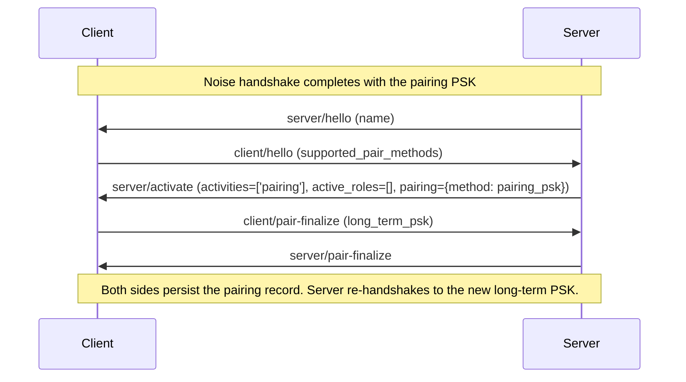
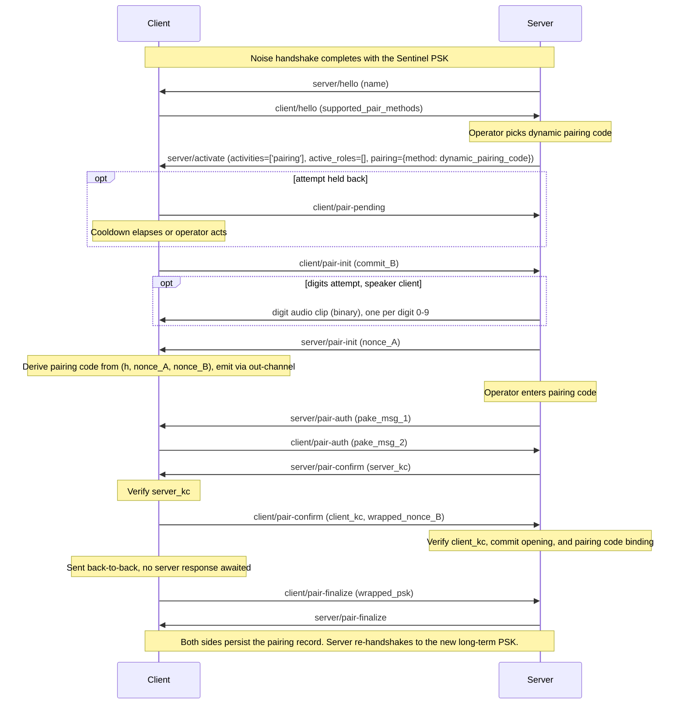
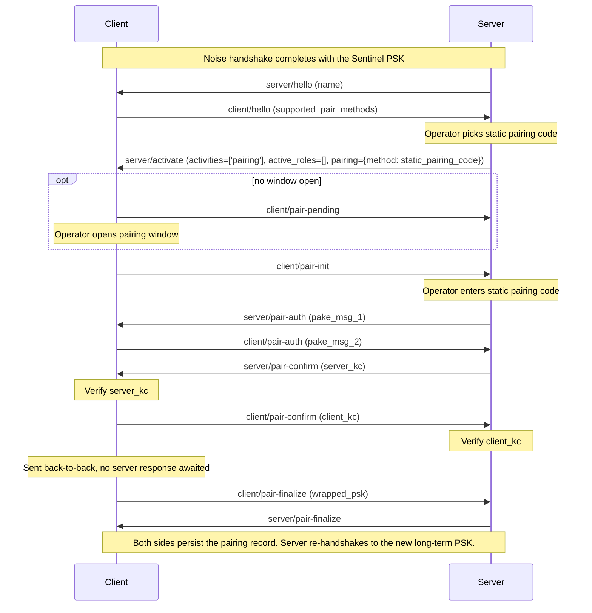

## Pairing

Pairing is the one-time setup that mutually authenticates a client and a server. The pairing flow uses the same WebSocket endpoint and [`KKpsk2`](connection.md#encryption) Noise pattern as every other connection; only the PSK fed into the handshake and the client's post-handshake routing differ (see [Pre-Shared Key](connection.md#pre-shared-key)). After any successful pairing both sides persist the new pairing record, then the server initiates an in-band [re-handshake](connection.md#re-handshake) to the newly delivered `long_term_psk`, promoting the channel to a paired session without closing the WebSocket.

This specification defines three pairing methods. Servers must implement all three; clients must implement Pairing PSK and may additionally offer at most one pairing-code method: Static Pairing Code or Dynamic Pairing Code.

### Methods

1. **Pairing PSK** - pairing authenticated by a [pairing PSK](README.md#definitions); no PAKE round, no pairing code. See [Pairing PSK Flow](#pairing-psk-flow).
2. **Dynamic Pairing Code** - pairing with a per-session [Pairing Code](README.md#definitions) that the client derives from a commit-and-reveal binding to the Noise handshake and emits via an out-channel (display, speaker, etc.) for the operator to enter into the server. See [Dynamic Pairing Code Flow](#dynamic-pairing-code-flow).
3. **Static Pairing Code** - pairing with a fixed [Pairing Code](README.md#definitions). Appropriate for devices with no out-channel; vulnerable to MITM if the pairing code is disclosed. See [Static Pairing Code Flow](#static-pairing-code-flow).

A code-based pairing runs over a Sentinel-keyed connection: the channel is unauthenticated until the [PAKE](#pake) round completes. The round establishes trust from scratch and produces a new [long-term PSK](README.md#definitions).

The client reveals the new long-term PSK only after `server_kc` verifies, and only as `wrapped_psk` [sealed under the CPace output](#wrapping): a peer that cannot complete the PAKE - wrong pairing code, or a man in the middle relaying between two handshakes, whose differing `h` gives each leg a different `sid` - neither triggers the reveal nor can unwrap it.

Static pairing methods (Pairing PSK, Static Pairing Code) do not take over the device's out-channel. Dynamic pairing (Dynamic Pairing Code) takes over the out-channel - typically the audio output or display - to emit the per-session pairing code, so it cannot run while audio is playing on the same device; the operator must stop playback before initiating pairing (see [Multiple servers](connection.md#multiple-servers-server-initiated)).

Clients with a usable out-channel (display, speaker, etc.) should offer `dynamic_pairing_code` rather than `static_pairing_code`, which is intended for devices without one. Clients whose display can render a QR code should also offer the `qr_code` [emission format](#dynamic-pairing-code-flow).

### Pairing Records

Each successful pairing produces a pairing record: the new [long-term PSK](README.md#definitions) persisted together with the server's `server_id`. The client MUST persist the new record, replacing any record it already holds for the server.

A client MUST be able to store at least 5 pairing records; more is allowed. When a pairing completes at capacity, the client MUST evict an existing record so that the new record persists - a pairing never fails for lack of record storage. Which record is evicted is implementation-defined (for example, the least recently used), except that the client MUST NOT evict a record backing a currently-open connection, provisional or admitted; the client MUST cap its concurrently open paired connections below its record capacity (see [Multiple servers](connection.md#multiple-servers-server-initiated)) so an evictable record always exists.

Eviction needs no wire signal. An evicted server's next handshake references a `psk_id` the client no longer holds and lands in the [Sentinel Fallback](connection.md#sentinel-fallback): the server receives an authenticated credential-mismatch signal and can offer its operator re-pairing.

### Entering and leaving pairing

Pairing and playback are mutually exclusive on a connection. When a server moves an established connection into pairing it first quiesces the client's streams - sending [`stream/end`](messaging.md#server--client-streamend) for active stream roles and a [`server/state`](messaging.md#server--client-serverstate) with null role objects for state roles, as when a role is removed from `active_roles` - and then sends the pairing [`server/activate`](messaging.md#server--client-serveractivate) with empty `active_roles`. The quiesce is stream-only: unlike an [`available: false`](messaging.md#external-source-handling) transition, the client keeps its group membership and queued group state through the pairing activity - no move to a solo group, no previous-group memory, no bar on resuming in place.

Each pairing `server/activate` admits one **pairing attempt**, in progress from its first pairing message - [`client/pair-init`](#client--server-clientpair-init) (pairing-code methods) or [`client/pair-finalize`](#client--server-clientpair-finalize) (Pairing PSK) - until success or [`pair/abort`](#client--server-pairabort). [`client/pair-pending`](#client--server-clientpair-pending) precedes an attempt and does not start it. The client bounds each attempt with an **attempt timeout** measured from its first message (recommended 2 minutes); on expiry it sends `pair/abort` with reason `attempt_timeout`.

The `server/activate` that ends the pairing transition declares the connection's resulting `activities` and reactivates roles via `active_roles`.

The same `server/activate` can also end a pairing attempt without finalizing: sent in place of [`server/pair-finalize`](#server--client-serverpair-finalize), it persists nothing and discards any received PSK. A client that, after sending [`client/pair-finalize`](#client--server-clientpair-finalize), receives `server/activate` likewise persists nothing.

After leaving pairing, a server silently discards pairing messages still in flight from the client - messages sent before the client observed the leave `server/activate`. A client that has aborted an attempt likewise silently discards pairing messages received before the next `server/activate`.

A server MAY send such a cancelling `server/activate` at any point during a pairing attempt. On receipt the client abandons the attempt, discarding all pairing state, and proceeds under the declared activities; an abandoned attempt does not count against a [pairing window](#pairing-window), and counts as a [failed attempt](#failed-attempts) only when the code was already being emitted. A server cancelling on operator action SHOULD first send [`pair/abort`](#client--server-pairabort) with reason `user_cancelled`, so the client can surface why the attempt ended. Servers SHOULD apply their own timeout while waiting for the attempt's first pairing message - [`client/pair-init`](#client--server-clientpair-init) or, in the Pairing PSK Flow, [`client/pair-finalize`](#client--server-clientpair-finalize) - cancelling as above on expiry.

### Unpaired Access

A client MAY admit a server with no pairing record to activate roles or declare the `'playback'` activity. The session is [unpaired](README.md#definitions). Whether a client admits unpaired access is governed by its `unpaired_access` setting: the default is the manufacturer's choice, changing it is a local client action (manufacturer-defined), and the current value is advertised in [`client/hello`](messaging.md#client--server-clienthello) as `unpaired_access.enabled`. A client that stops admitting unpaired access closes any connection relying on it with [`client/goodbye`](messaging.md#client--server-clientgoodbye) reason `'pairing_required'`.

On the server side, unpaired access is gated by **operator approval**, granted per [`client_id`](README.md#definitions): a server MUST NOT declare `'playback'` or activate roles on a Sentinel-keyed connection to a client its operator has not approved. The operator grants approval through a dedicated approval control. A server MAY also take an operator action that clearly means to use the client, such as starting playback on it, as implied approval. Approval SHOULD persist, MUST be revocable by the operator, and MUST be discarded on a successful pairing. There is no wire flag on the server's side: it extends unpaired access simply by activating roles or declaring `'playback'` in [`server/activate`](messaging.md#server--client-serveractivate). The server MAY hold the connection at empty `activities`, ready to activate roles once approved, or to enter pairing.

While a client is unapproved, the server SHOULD identify and present it to the operator. When presenting clients, a server MUST clearly distinguish those that are neither paired nor approved from those that are, so a new client claiming a familiar name cannot pass for an existing device. When an unapproved client offers pairing, the server MUST present it as a clearly available action for that client. For an approved client, pairing SHOULD stay available as an upgrade.

**Security.** Unpaired connections are vulnerable to **man-in-the-middle attacks**. The Sentinel PSK is a published constant, and in the unpaired case neither peer's static key is bound to its identity by any authenticated out-of-band exchange; an attacker on the local network may therefore impersonate either side. The Noise handshake still provides confidentiality and replay protection for the session itself, but offers no assurance about which peer it was established with.

### Pairing PSK Flow

The Noise handshake completes using the pairing PSK, authenticating both sides. The client proceeds straight to [`client/pair-finalize`](#client--server-clientpair-finalize).

**Lifecycle.** The client's pairing PSK MUST be drawn from a [CSPRNG](README.md#definitions) per device and MUST NOT be a fixed default shared across devices, whether provisioned at manufacture or generated by the client. It persists across reboots and is per-client and long-lived: a successful pairing does not consume it (pairing produces a separate [long-term PSK](README.md#definitions)), so it can pair the client with any number of servers.



If a connection is already open under any other PSK - Sentinel or a [long-term PSK](README.md#definitions) - when the operator picks `pairing_psk`, the server first [re-handshakes](connection.md#re-handshake) to the pairing PSK before sending the `server/activate` shown above.

Two standing client obligations follow from this flow:

1. The client MUST keep its pairing PSK among its handshake PSK candidates at all times, not only while a pairing activity is running: the server's re-handshake to the pairing PSK succeeds only if the client already recognizes its `psk_id`.
2. Before sending [`client/pair-finalize`](#client--server-clientpair-finalize), the client MUST verify that the connection's matched PSK is the pairing PSK (the receiving side of the `pairing.method` invariant in [`server/activate`](messaging.md#server--client-serveractivate)); on mismatch it aborts with [`pair/abort`](#client--server-pairabort) reason `method_not_supported`.

**Pairing Token.** A server needs both the [pairing PSK](README.md#definitions) and the client's static public key to select and verify the client's Noise identity. The two are distributed together in a version-0 [pairing token](#pairing-token):

```
payload = client_key (32 bytes) || pairing_psk (32 bytes)
```

- `client_key` - the raw 32-byte Curve25519 public key whose base64url form is the [`client_id`](connection.md#identities).
- `pairing_psk` - the raw 32-byte [pairing PSK](README.md#definitions).

The operator enters the token into the server to begin the flow. The pairing PSK MUST be exposed as the token, not the bare PSK. Before pairing, the server MUST confirm the decoded `client_key` matches the `client_id` presented on the connection.

The reference vector for `client_key = 0x00 0x01 … 0x1f` and `pairing_psk = 0xe0 0xe1 … 0xff`:

```
SP:0AAAQEAYEAUDAOCAJBIFQYDIOB4IBCEQTCQKRMFYYDENBWHA5DYP6BYPC4PSOLZXH5DU6V97M5XXO74HR6LZ7J5PW674PT6X37T6757Y
```

### Dynamic Pairing Code Flow

Pairing with a per-session pairing code derived from the Noise handshake and emitted by the client via its out-channel, in one of two **emission formats** (the activation's [`format`](messaging.md#server--client-serveractivate)): `digits` - a decimal code the operator types into the server - or `qr_code` - a code rendered as a QR code that the operator scans into the server. Either way, a [PAKE](#pake) round authenticates both sides. An attempt may be [held back](#failed-attempts) before it starts.



**Binding values.** The Dynamic Pairing Code Flow introduces three values across two messages that bind the pairing code to the underlying Noise handshake:

- `nonce_A` - 32 bytes drawn from a [CSPRNG](README.md#definitions) by the server, sent in [`server/pair-init`](#server--client-serverpair-init), base64url-encoded (43 chars).
- `nonce_B` - 32 bytes drawn from a [CSPRNG](README.md#definitions) by the client, kept private until [`client/pair-confirm`](#client--server-clientpair-confirm) reveals it as `wrapped_nonce_B`, [sealed under the CPace output](#wrapping).
- `commit_B` - `SHA-256("sendspin-pair-commit-v1" || nonce_B)`, sent by the client in [`client/pair-init`](#client--server-clientpair-init) before any value from the server is known (32 bytes base64url-encoded, 43 chars). Locks the client's contribution to the pairing code derivation.

**Pairing code derivation.** Both formats derive the pairing code from the same digest of the Noise handshake hash `h` and the two nonces:

```
digest   = SHA-256("sendspin-pairing-code-derive-v1" || h || nonce_A || nonce_B)

digits:   code_int = uint256_be(digest) mod 10^6
          code     = decimal(code_int) zero-padded to 6 digits
qr_code:  code     = digest[0..23]
```

The hash input is the UTF-8 bytes of the literal label `"sendspin-pairing-code-derive-v1"` (no separator, no NUL terminator) followed by `h` (32 bytes, raw), `nonce_A` (32 bytes, raw), and `nonce_B` (32 bytes, raw). In the `digits` format the full 32-byte SHA-256 output is interpreted as an unsigned big-endian 256-bit integer and reduced modulo 10^6, zero-padded on the left to exactly 6 ASCII digits. The pairing code bytes fed into CPace as `PRS` are these 6 ASCII digits - the same per-digit encoding as the static pairing code. In the `qr_code` format the pairing code is binary - the first 24 bytes of the digest - and the code bytes fed into CPace as `PRS` are these 24 raw bytes.

**Digits emission.** A client that displays the pairing code follows [Pairing Code Presentation](#pairing-code-presentation). A client that speaks it reads single digits in the [presentation groups](#pairing-code-presentation); it SHOULD leave a short gap between digits and a longer one between groups. The digits themselves come from a **digit audio pack** supplied by the server: ten mono clips, one recording of each decimal digit `0`-`9`, trimmed to the spoken digit, in a language of the server's choosing.

**Digit audio pack.** A speaker client advertises the pack it wants as `digit_audio` in its [`dynamic_pairing_code` descriptor](#client--server-clienthello-pair-method-descriptor) - the format it accepts and `max_bytes`, the largest encoded pack size it accepts. Servers MUST be able to supply the pack in any such format: all three codecs, at any sample rate and bit depth. In a `digits` attempt, after [`client/pair-init`](#client--server-clientpair-init) the server delivers the clips as [digit audio clip](#server--client-digit-audio-clip-binary) messages in ascending digit order, each at most 2 seconds of audio and together at most `max_bytes` encoded. [`server/pair-init`](#server--client-serverpair-init) then completes the pack. The client emits by playing the clip for each code digit in turn. The pack is presentation-only - clips never enter the derivation or `PRS` - and is discarded when the attempt ends. The client verifies each clip as it arrives, before any is played. A clip over 2 seconds, a pack over `max_bytes`, a clip undecodable or whose embedded stream parameters contradict the client's format, or a pack still incomplete when `server/pair-init` arrives is a [protocol error](#protocol-errors).

In initial pairing the pack comes from an unauthenticated peer, which thereby chooses what the client's speaker plays. The clip constraints keep each clip short, and the peer, unable to predict the code, cannot choose which clips play or in what order, so they cannot be strung into a longer message.

**QR-code emission.** In the `qr_code` format the client presents the pairing code as a version-1 [pairing token](#pairing-token) with the 24-byte code as its payload (39 body characters), rendered as a QR code on its display. The server applies the token [decoding](#pairing-token) rules to operator input; the first 24 payload bytes are the entered pairing code.

The reference vector for `code = 0xe0 0xe1 … 0xf7`:

```
SP:14DQ6FY7E4XTOP9HJ5LV6Z3PO57YPD4XT6T97N5Y
```

**Client verification.** On receipt of [`server/pair-confirm`](#server--client-serverpair-confirm), the client verifies the CPace MCF tag `server_kc`. On failure the client sends [`pair/abort`](#client--server-pairabort) with reason `pairing_code_mismatch`.

**Server verification.** When [`client/pair-confirm`](#client--server-clientpair-confirm) arrives, the server verifies, in this order:

1. CPace MCF tag `client_kc`
2. `wrapped_nonce_B` [unwraps](#wrapping) to a `nonce_B` with `SHA-256("sendspin-pair-commit-v1" || nonce_B) == commit_B`
3. `derived_code(h, nonce_A, nonce_B) == code_entered`

A failed key confirmation results in [`pair/abort`](#client--server-pairabort) with reason `pairing_code_mismatch`. A `wrapped_nonce_B` that fails to decrypt, a recovered `nonce_B` that does not match `commit_B`, or an entered code that fails the binding check is a [protocol error](#protocol-errors). Any failure discards the received `wrapped_psk`. Only when all three checks pass does the server process [`client/pair-finalize`](#client--server-clientpair-finalize), [unwrapping](#wrapping) the PSK.

#### Failed attempts

An attempt counts as failed once the client has started emitting the code and the attempt ends without a successful verification of `server_kc`. After 20 consecutive failed attempts the client MUST hold attempts back until a deliberate, manufacturer-defined operator action. The count is not partitioned by `server_id` or source address and resets on a successful verification or on that action. A client MAY hold attempts back earlier, by a cooldown or by an operator action, including from the first attempt.

The limit is not an error state - the method stays offered - and while it holds an attempt back the client sends [`client/pair-pending`](#client--server-clientpair-pending), optionally saying in `message` what it waits for.

### Static Pairing Code Flow

Pairing with a fixed pairing code. The operator types it into the server, where a [PAKE](#pake) round authenticates both sides. Every attempt is gesture-gated by a [pairing window](#pairing-window).

**Lifecycle.** The static pairing code is a fixed 8-digit value. A factory-provisioned pairing code MUST be drawn uniformly at random from a [CSPRNG](README.md#definitions) per device and MUST NOT be a fixed default shared across devices; a shared default would let anyone pair with any such device.



**Client verification.** On receipt of [`server/pair-confirm`](#server--client-serverpair-confirm), the client verifies the CPace MCF tag `server_kc`. On failure the client sends [`pair/abort`](#client--server-pairabort) with reason `pairing_code_mismatch`.

**Server verification.** When [`client/pair-confirm`](#client--server-clientpair-confirm) arrives, the server verifies the CPace MCF tag `client_kc` before processing [`client/pair-finalize`](#client--server-clientpair-finalize). On failure the server sends [`pair/abort`](#client--server-pairabort) with reason `pairing_code_mismatch` and discards the received `wrapped_psk`. On success it processes `client/pair-finalize`, [unwrapping](#wrapping) the PSK.

#### Pairing Window

The Static Pairing Code Flow gates every attempt on a **pairing window**: a state in which the client has decided to accept pairing attempts. The window admits up to **5** attempts, all on the connection that carries its first, and closes on a completed pairing, its fifth failed attempt (the client's verification of `server_kc` fails), drop of that connection, operator cancellation, or window-lifetime expiry. An attempt that ends any other way - timed out or cancelled - only ends that attempt; the window stays open for another.

An attempt is **gesture-gated** - the client withholds [`client/pair-init`](#client--server-clientpair-init) until a window is open - for every `static_pairing_code` attempt.

Pairing Window mechanics:

- **Opening the window.** An operator gesture on the client - a physical button press, a reset-pinhole press, a button combo, a specific power-cycle pattern, a shake or motion gesture, or any equivalent implementation-defined action. Gestures SHOULD be deliberate and hard to induce remotely.
- **Window lifetime.** From window opening, paused while an attempt is in progress. Recommended 5 minutes. On expiry, the window closes silently.
- **Signal to the server.** The client sends [`client/pair-init`](#client--server-clientpair-init) once the window is open and the [`server/activate`](messaging.md#server--client-serveractivate) has arrived; while a gesture is awaited it signals [`client/pair-pending`](#client--server-clientpair-pending), optionally naming the gesture in `message`. The server must not send [`server/pair-auth`](#server--client-serverpair-auth) until it has received `client/pair-init`.

### Pairing Code Presentation

Grouping is presentation-only: the pairing code value is the contiguous digits, and separators never enter derivation, entry, or `PRS`. The 6-digit dynamic pairing code SHOULD be presented grouped `3-3`, the 8-digit static pairing code `4-4`, with a hyphen between groups (`123-456`, `1234-5678`). Servers SHOULD present matching grouped entry that makes the expected length evident (e.g. one slot per digit) and SHOULD strip separator characters (spaces, hyphens) from typed input.

### Pairing Token

A **pairing token** is a single case-insensitive ASCII string carrying a pairing secret, which the operator transfers out of band (copy/paste, QR scan) from the client into the server. A token is a fixed `SP:` prefix, a version, and a base32-encoded body:

```
token = "SP:" || version || body
```

- `version` - a single alphanumeric character selecting the payload the body carries. This document defines version `0` - a [pairing PSK with the client identity](#pairing-psk-flow) - and version `1` - a per-session [dynamic pairing code](#dynamic-pairing-code-flow) in the `qr_code` emission format.

A payload becomes `body` by:

1. base32-encoding it per [RFC 4648](https://www.rfc-editor.org/rfc/rfc4648#section-6) (alphabet `A–Z`, `2–7`),
2. stripping the `=` padding, then
3. transliterating every `2` to `9`.

Tokens are drawn only from the QR code alphanumeric set (`0–9`, `A–Z`, `:`), so they render as compact QR codes and survive manual transcription. A QR code carries the token string verbatim, with no URI scheme or wrapper, so a scan and a copy/paste yield identical input.

Decoding reverses the transform and MUST be lenient with operator-supplied input:

1. Trim surrounding whitespace and upper-case it.
2. If present, strip a leading `SP:`. The first character is the `version`; reject an unrecognized version. An interface expecting a specific version rejects the others.
3. Transliterate every `9` back to `2`, re-pad with `=` to a multiple of 8 characters, and base32-decode into the payload.

A decoder MUST reject malformed input, including a payload shorter than its version defines. Payload bytes beyond those the version defines are reserved for future extension: a decoder MUST ignore them.

### PAKE

The code-based pairing flows use **CPACE-X25519-SHA512** as the PAKE construction, defined in [draft-irtf-cfrg-cpace-21](https://datatracker.ietf.org/doc/draft-irtf-cfrg-cpace/21/). The protocol runs in initiator-responder mode with explicit Mutual Confirmation Flow (MCF). The server takes role `A` (initiator); the client takes role `B` (responder).

Sendspin instantiates CPace's inputs as follows:

- `PRS` - the pairing code as a byte string: the literal decimal digits as UTF-8 (e.g., `0x31 0x32 0x33 0x34 0x35 0x36 0x37 0x38` for the pairing code `"12345678"`), or in the `qr_code` emission format the raw 24-byte code.
- `sid` - the UTF-8 bytes `"sendspin-pair-pake-v1"` || `h` || `counter`. `h` is the Noise handshake hash (32 bytes, raw) available immediately after Noise transport mode begins; `counter` is the number of pairing [`server/activate`](messaging.md#server--client-serveractivate) messages sent since the last Noise handshake, encoded as a big-endian uint32 (4 bytes).
- `CI` - empty.
- `ADa` - the UTF-8 bytes `"server"`.
- `ADb` - the UTF-8 bytes `"client"`.

The four pairing message fields carry the corresponding CPace values, base64url-encoded without padding:

| Sendspin field | Carried in | CPace value | Bytes | base64url length |
|---|---|---|---|---|
| `pake_msg_1` | [`server/pair-auth`](#server--client-serverpair-auth) | `Ya` (server's public share) | 32 | 43 |
| `pake_msg_2` | [`client/pair-auth`](#client--server-clientpair-auth) | `Yb` (client's public share) | 32 | 43 |
| `server_kc` | [`server/pair-confirm`](#server--client-serverpair-confirm) | `Ta` (server's MCF tag, HMAC-SHA-512) | 64 | 86 |
| `client_kc` | [`client/pair-confirm`](#client--server-clientpair-confirm) | `Tb` (client's MCF tag, HMAC-SHA-512) | 64 | 86 |

### Wrapping

In the code-based flows, two values cross the wire only sealed under the CPace output: the new long-term PSK, carried as `wrapped_psk` in [`client/pair-finalize`](#client--server-clientpair-finalize), and - in the Dynamic Pairing Code Flow - the commitment opening `nonce_B`, carried as `wrapped_nonce_B` in [`client/pair-confirm`](#client--server-clientpair-confirm). Both sides derive a key per field:

```
K_wrap = SHA-256(label || sid || ISK)
```

with `label` `"sendspin-pair-psk-wrap-v1"` for `wrapped_psk` and `"sendspin-pair-nonce-wrap-v1"` for `wrapped_nonce_B`. The hash input is the UTF-8 bytes of the literal label (no separator, no NUL terminator) followed by `sid` (the CPace session id defined in [PAKE](#pake), raw) and `ISK` (the 64-byte CPace intermediate session key, raw). To wrap, the client encrypts the 32-byte value with the AEAD of the connection's negotiated [cipher suite](connection.md#cipher-suites), key `K_wrap`, a 12-byte all-zero nonce, and empty associated data; the field carries the 48-byte ciphertext-plus-tag, base64url-encoded without padding (64 chars). To unwrap, the server decrypts with the same AEAD, key, and nonce, recovering the 32-byte value.

### Protocol Errors

A condition during pairing that no conformant peer produces - a malformed or missing field, a CPace share with the wrong length or encoding a low-order point, a revealed nonce that does not match its commitment, an entered code that fails the binding check, a `wrapped_nonce_B` or `wrapped_psk` that fails to decrypt, a malformed digit audio pack - is a **protocol error**: the detecting side closes the WebSocket without sending any application-level error message, and persists nothing.

### Client → Server: `client/hello` pair-method descriptor

`supported_pair_methods` in [`client/hello`](messaging.md#client--server-clienthello) is an object keyed by pairing method identifier. Each value is a descriptor object that advertises the kind of operator interaction the client expects so the server can render appropriate UX.

A client MUST NOT list both `static_pairing_code` and `dynamic_pairing_code` (see [Methods](#methods)). A server that nevertheless receives both MUST disregard the `static_pairing_code` descriptor and proceed as if only `dynamic_pairing_code` were advertised, so a non-conformant advertisement degrades to the safer method rather than to undefined behavior.

- `pairing_psk?`: object
  - `locations?`: ('device' | 'leaflet' | 'operator')[]
- `static_pairing_code?`: object
  - `locations?`: ('device' | 'leaflet' | 'operator')[]
- `dynamic_pairing_code?`: object
  - `out_channels`: ('display' | 'speaker')[] - the channels through which the per-session pairing code is conveyed to the operator.
  - `formats`: ('digits' | 'qr_code')[] - the [emission formats](#dynamic-pairing-code-flow) the client offers. Non-empty; `qr_code` requires a display able to render a QR code.
  - `digit_audio?`: object - the server-supplied [digit audio pack](#dynamic-pairing-code-flow) the client wants. Required when `out_channels` includes `'speaker'`, absent otherwise.
    - `codec`: 'opus' | 'flac' | 'pcm' - codec identifier
    - `sample_rate`: integer - sample rate in Hz (e.g., 16000)
    - `bit_depth`: integer - bit depth (e.g., 16); meaningful for `pcm` and `flac` only, ignored for `opus`
    - `max_bytes`: integer - maximum total encoded size of the ten clips in bytes

`locations` is an informational hint listing where the operator can find the method's configured secret: printed on the device, on a leaflet in the box, or set by the operator. A printed pairing PSK MUST be rendered as a QR code of its [pairing token](#pairing-token).

A server MUST ignore a key it does not recognize - leaving its value unvalidated - and select only among the rest. It MUST likewise ignore unrecognized `formats`, `out_channels`, and `locations` values, treating a `dynamic_pairing_code` left with no recognized format or no recognized channel as an unrecognized key; an unrecognized `digit_audio.codec` is treated as `'speaker'` being absent. Identifiers not defined here are reserved for future revisions of this specification. As with [unimplemented roles](README.md#detecting-outdated-servers), servers should track ignored identifiers: they indicate the client speaks a newer revision than the server.

### Messages

The pairing messages below are listed in the order they appear in the Dynamic Pairing Code Flow (the most complete sequence), except the binary [digit audio clip](#server--client-digit-audio-clip-binary), which comes last. The Static Pairing Code Flow omits the [`server/pair-init`](#server--client-serverpair-init) message and the `commit_B` / `wrapped_nonce_B` fields; the Pairing PSK Flow additionally omits all `pair-pending`, `pair-init`, `pair-auth`, and `pair-confirm` messages.

**Sequence violations.** A pairing message that is out of sequence for the selected method and current state - and not covered by the silent-discard rules in [Entering and leaving pairing](#entering-and-leaving-pairing) - is a [protocol error](#protocol-errors).

**Pairing index.** [`client/pair-pending`](#client--server-clientpair-pending) and [`client/pair-init`](#client--server-clientpair-init) carry a `pairing_index` - the number of pairing [`server/activate`](messaging.md#server--client-serveractivate) messages received since the last Noise handshake. A value lower than the server's own count is a leftover from a superseded pairing and is discarded silently; a higher value is a [protocol error](#protocol-errors).

#### Client → Server: `client/pair-pending`

Reports that the client is holding back the selected attempt: no [pairing window](#pairing-window) is open, or its [attempt limit](#failed-attempts) has not admitted it yet. Sent immediately on receiving such a pairing [`server/activate`](messaging.md#server--client-serveractivate); [`client/pair-init`](#client--server-clientpair-init) follows once the client is ready. Does not start the [attempt](#entering-and-leaving-pairing) or its timeout. The server SHOULD surface the pending state and any `message` to the operator and apply its own timeout (see [Entering and leaving pairing](#entering-and-leaving-pairing)).

- `pairing_index`: integer - see [Pairing index](#messages)
- `message?`: string - a short plain-text sentence for the operator, at most 200 characters, such as what to do to proceed, preferably in one of the server's [`languages`](messaging.md#server--client-serverhello). It comes from an unauthenticated peer: the server shows it as text attributed to the device, truncates it to that length, and MUST NOT interpret markup or links in it

#### Client → Server: `client/pair-init`

Starts the code-based pairing [attempt](#entering-and-leaving-pairing). Sent once the pairing [`server/activate`](messaging.md#server--client-serveractivate) has arrived and the client is not [holding the attempt back](#client--server-clientpair-pending). The server must not send [`server/pair-auth`](#server--client-serverpair-auth) (static pairing code) or [`server/pair-init`](#server--client-serverpair-init) and the [digit audio clips](#server--client-digit-audio-clip-binary) (dynamic pairing code) before receiving this message.

- `pairing_index`: integer - see [Pairing index](#messages); only a match starts the attempt
- `commit_B?`: string - `SHA-256("sendspin-pair-commit-v1" || nonce_B)` (32 bytes base64url-encoded, 43 chars). Required in the [Dynamic Pairing Code Flow](#dynamic-pairing-code-flow); absent in the [Static Pairing Code Flow](#static-pairing-code-flow).

#### Server → Client: `server/pair-init`

Server's nonce contribution in the [Dynamic Pairing Code Flow](#dynamic-pairing-code-flow). Sent in response to [`client/pair-init`](#client--server-clientpair-init).

- `nonce_A`: string - 32 bytes drawn from a [CSPRNG](README.md#definitions), base64url-encoded (43 chars). See [Dynamic Pairing Code Flow](#dynamic-pairing-code-flow)

In a `digits` attempt with a speaker client, this message follows the ten [digit audio clips](#server--client-digit-audio-clip-binary) and completes the pack. Upon receipt, the client derives and emits the pairing code; the operator then types or scans it into the server.

#### Server → Client: `server/pair-auth`

Server's CPace public share. Sent once the server has both received [`client/pair-init`](#client--server-clientpair-init) and obtained the pairing code from the operator. In the Static Pairing Code Flow the pairing code is available to the operator from the start; in the Dynamic Pairing Code Flow the client emits it after [`server/pair-init`](#server--client-serverpair-init).

- `pake_msg_1`: string - server's CPace public share `Ya` (32 bytes base64url-encoded, 43 chars). See [PAKE](#pake)

#### Client → Server: `client/pair-auth`

Client's CPace public share, sent in response to [`server/pair-auth`](#server--client-serverpair-auth).

- `pake_msg_2`: string - client's CPace public share `Yb` (32 bytes base64url-encoded, 43 chars). See [PAKE](#pake)

#### Server → Client: `server/pair-confirm`

Server's MCF tag, sent after the server has derived its CPace session key from `Yb`.

- `server_kc`: string - server's MCF tag `Ta` (64 bytes base64url-encoded, 86 chars). See [PAKE](#pake)

On receipt, the client verifies `server_kc` before sending [`client/pair-confirm`](#client--server-clientpair-confirm); see [Dynamic Pairing Code Flow](#dynamic-pairing-code-flow) / [Static Pairing Code Flow](#static-pairing-code-flow).

#### Client → Server: `client/pair-confirm`

Client's MCF tag, plus (in the Dynamic Pairing Code Flow) the sealed opening of the earlier commitment. In code-based pairing, the client sends [`client/pair-finalize`](#client--server-clientpair-finalize) immediately after this message without waiting for a server response.

- `client_kc`: string - client's MCF tag `Tb` (64 bytes base64url-encoded, 86 chars). See [PAKE](#pake)
- `wrapped_nonce_B?`: string - 48-byte [wrapping](#wrapping) of the preimage of `commit_B` sent earlier in [`client/pair-init`](#client--server-clientpair-init), base64url-encoded (64 chars). Present only in the [Dynamic Pairing Code Flow](#dynamic-pairing-code-flow).

On receipt, the server verifies before processing [`client/pair-finalize`](#client--server-clientpair-finalize); see [Dynamic Pairing Code Flow](#dynamic-pairing-code-flow) / [Static Pairing Code Flow](#static-pairing-code-flow).

#### Client → Server: `client/pair-finalize`

Delivers the long-term PSK established by this pairing. In flows that include a PAKE round, this message is sent immediately after [`client/pair-confirm`](#client--server-clientpair-confirm) without waiting for a server response, and carries the PSK [wrapped](#wrapping) under the CPace output. In the [Pairing PSK Flow](#pairing-psk-flow), it starts the pairing [attempt](#entering-and-leaving-pairing) and is sent immediately after the [`server/activate`](messaging.md#server--client-serveractivate), carrying the PSK directly. Exactly one of the two fields is present.

- `long_term_psk?`: string - 43-character base64url-encoded 32-byte [long-term PSK](README.md#definitions) (no padding). [Pairing PSK Flow](#pairing-psk-flow) only
- `wrapped_psk?`: string - 64-character base64url-encoded 48-byte [wrapping](#wrapping) of the new [long-term PSK](README.md#definitions) (no padding). Code-based flows only

#### Server → Client: `server/pair-finalize`

Acknowledges that the server has persisted the pairing record. After receiving this message, the client persists its own record.

- payload: `{}`

#### Client ↔ Server: `pair/abort`

Aborts a pairing attempt, started or not. With reason `concurrent_attempt` the sender closes the connection after sending, otherwise the connection stays open. A `pair/abort` received after the receiver has itself ended the attempt has no effect.

- `reason`: string - one of:
  - `attempt_timeout` (client) - the pairing attempt did not complete within the [attempt timeout](#entering-and-leaving-pairing)
  - `concurrent_attempt` (client) - another pairing attempt is already in progress with this client
  - `method_not_supported` (client) - the server's activity set and `pairing.method` are not a permitted combination for the matched PSK, or `pairing.method` names a method the client does not currently offer, or `pairing.format` names an emission format the client does not currently offer
  - `pairing_code_mismatch` (client or server) - PAKE key-confirmation failed
  - `user_cancelled` (client or server) - operator aborted the pairing through a local UI

#### Server → Client: Digit Audio Clip (Binary)

One clip of a [digit audio pack](#dynamic-pairing-code-flow).

Sent only in a `digits` attempt with a speaker client, after [`client/pair-init`](#client--server-clientpair-init) and before [`server/pair-init`](#server--client-serverpair-init): ten messages in ascending digit order, together at most the descriptor's [`max_bytes`](#client--server-clienthello-pair-method-descriptor). A clip outside that window, out of order, duplicated, or with a digit above 9 is a [sequence violation](#messages).

- Byte 0: message type `2` (uint8)
- Byte 1: digit (uint8) - the decimal digit `0`-`9` the clip speaks
- Rest of bytes: the clip in the client's format

**Clip contents:** Each clip carries one whole spoken digit - mono, at most 2 seconds - in the format of the client's descriptor [`digit_audio`](#client--server-clienthello-pair-method-descriptor); a clip whose embedded stream parameters contradict it - a FLAC STREAMINFO with other channels, sample rate, or bit depth, an OpusHead with other channels - is malformed. Per codec:

- `pcm`: samples encoded as little-endian signed integers (two's complement), 24-bit samples packed as 3 bytes per sample.
- `flac`: a complete FLAC stream - `fLaC` marker, STREAMINFO block, frames.
- `opus`: an [Ogg Opus](https://www.rfc-editor.org/rfc/rfc7845) stream.
