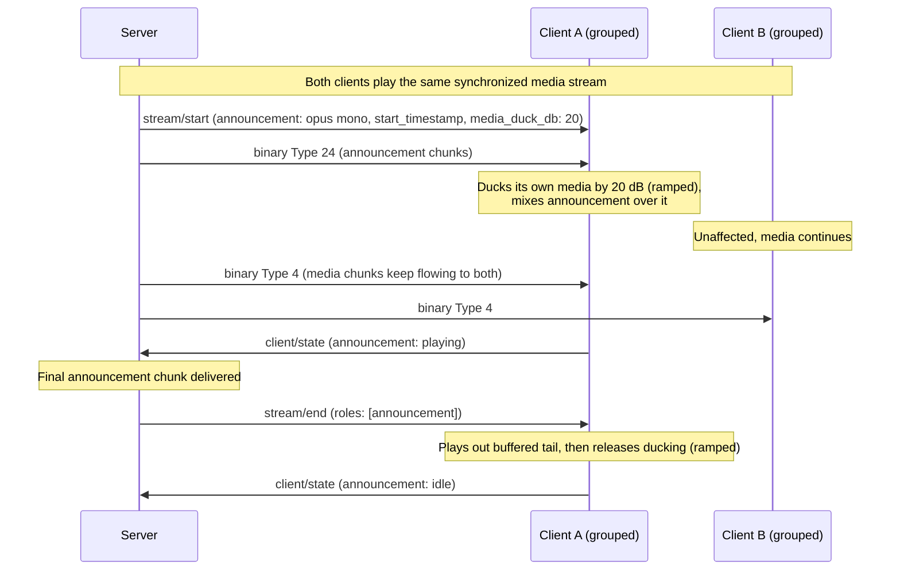

## Announcement messages
This section describes messages specific to clients with the `announcement` role: short client-specific audio clips (voice-assistant responses, chimes, alerts) delivered as their own stream, independent of the `player` role's media stream. An announcement plays mixed over the media, optionally ducking it, or on its own when nothing is playing. It never pauses, stops, or shifts the media timeline.

Announcements are addressed per client. To announce on several clients, the server starts one stream per client with the same `start_timestamp`. Sample-accurate cross-client synchronization of announcement audio is out of scope.

The role is optional and MAY be advertised without `player@v1` (e.g. a notification-only device).

**Note:** As with the player role, volume values (0-100) represent perceived loudness. Clients SHOULD convert volume to a linear amplitude as `amplitude = (volume / 100)^1.5`, applied over a short ramp.

### Client → Server: `client/hello` announcement@v1 support object

The `announcement@v1_support` object in [`client/hello`](../../messaging.md#client--server-clienthello) has this structure:

- `announcement@v1_support`: object
  - `supported_formats`: object[] - non-empty list of supported announcement audio formats in priority order (first is preferred)
    - `codec`: 'opus' | 'flac' | 'pcm' - codec identifier
    - `channels`: integer - number of channels (e.g., 1 = mono, 2 = stereo)
    - `sample_rate`: integer - sample rate in Hz (e.g., 48000)
    - `bit_depth`: integer - bit depth (e.g., 16, 24); meaningful for `pcm` and `flac` only, ignored for `opus`
  - `buffer_capacity`: integer - max size in bytes of compressed announcement audio in the buffer that is yet to be played

Servers MUST support the `flac` and `pcm` codecs and MAY support `opus`. Clients MUST list either `flac` or `pcm` and MAY list both, and MAY list `opus` in addition. Announcements decode on a second pipeline next to the media stream, so clients SHOULD advertise inexpensive formats (e.g., mono, 16-bit). The format list and `buffer_capacity` are independent of the player role's.

**Note:** Opus is covered by third-party patents. Implementers that ship `opus` in a commercial product are responsible for any license fees that apply; the patent pool does not target open-source software distributed independently from a hardware device.

### Client → Server: `client/state` announcement object

The `announcement` object in [`client/state`](../../messaging.md#client--server-clientstate) has this structure. Only for clients with the `announcement` role. The client includes it in the `client/state` sent when the role is activated (empty if it has nothing to report) and whenever a reported field changes.

- `announcement`: object
  - `state?`: 'playing' | 'idle' - whether announcement audio is currently being output
  - `required_lead_time_ms?`: non-negative integer - minimum startup lead time in milliseconds for the announcement pipeline, measured from the server transmit time of `stream/start` to `start_timestamp`. When absent, the server SHOULD assume 500 ms

### Server → Client: `stream/start` announcement object

The `announcement` object in [`stream/start`](../../messaging.md#server--client-streamstart) has this structure:

- `announcement`: object
  - `codec`: 'opus' | 'flac' | 'pcm' - codec to be used
  - `sample_rate`: integer - sample rate to be used
  - `channels`: integer - channels to be used
  - `bit_depth`: integer - bit depth to be used; ignored for `opus`
  - `codec_header?`: string - codec header encoded as standard Base64, if necessary (e.g., FLAC)
  - `start_timestamp`: integer - server clock time in microseconds when output should begin. Clients translate it via [clock synchronization](../../messaging.md#clock-synchronization) and start at that time, or as soon as possible if it has passed or no synchronization is established. The same value on several clients gives a coordinated start
  - `media_duck_db?`: non-negative integer - attenuation in dB applied to the client's media signal while the announcement is active; `x` dB scales amplitude by `10^(-x/20)`. Default 0 (no ducking). A large value (e.g. 200) silences the media
  - `duck_ramp_ms?`: integer - ramp duration in milliseconds (0-2000, default 100) for applying and releasing the ducking
  - `volume?`: integer - range 0-100. When present, the announcement is rendered at the loudness master volume `volume` would produce, independent of the current master volume (see [Mixing and Ducking](#mixing-and-ducking)). When absent, it follows the master volume

The format MUST be one the client listed in its [`supported_formats`](#client--server-clienthello-announcementv1-support-object).

Re-sending `stream/start` with an `announcement` object while a stream is active updates `media_duck_db`, `duck_ramp_ms`, and `volume` without clearing buffers: a new duck level ramps from the current gain over the new `duck_ramp_ms`, which also applies to the release. To play a different clip, the server first ends the stream with [`stream/end`](#server--client-streamend-announcement).

### Server → Client: `stream/end` announcement

An announcement stream ends only when [`stream/end`](../../messaging.md#server--client-streamend) lists the `announcement` role; a `stream/end` that omits `roles` leaves an active announcement running. On `stream/end`, no more announcement audio follows: the client plays out its buffered announcement audio, then releases the ducking over `duck_ramp_ms` and reports `state: 'idle'` if it reports state. The server sends it after the final chunk; sending it earlier ends the announcement once the audio already buffered has played.

### Server → Client: Announcement Chunks (Binary)

Binary messages SHOULD be rejected if there is no active announcement stream or the client is not [`available`](../../messaging.md#client--server-clientstate).

- Byte 0: message type `24` (uint8)
- Rest of bytes: one encoded audio frame in the negotiated format

For `pcm`, samples are little-endian signed integers (two's complement), interleaved by channel, with 24-bit samples packed as 3 bytes; a message carries a whole number of PCM frames. A `flac` message carries one or more complete FLAC frames; the `fLaC` marker and STREAMINFO are delivered once in `codec_header`. An `opus` message carries exactly one Opus packet ([RFC 6716](https://www.rfc-editor.org/rfc/rfc6716)) with no container.

Chunks carry no timestamp. The client decodes them in order and plays them continuously from `start_timestamp`, and MUST NOT drop a chunk for arriving late; if audio is produced slower than real time (e.g., streaming text-to-speech), the output stretches accordingly. The player's [sync accuracy rules](../player/v1.md#playback-synchronization) do not apply.

## Announcement Playback Behavior

### Mixing and Ducking

The client mixes the announcement with its media locally. `media_duck_db` attenuates the media signal before mixing; master volume and mute apply to the mixed output. An announcement with `volume` is instead rendered at the amplitude master volume `volume` would produce and is not scaled by the master volume, so it keeps that loudness at any master volume; mute still silences it. Master volume and mute are the player object's [`volume` and `muted`](../player/v1.md#client--server-clientstate-player-object) when the client has the `player` role, otherwise the client's own controls, if any.

Starting an announcement MUST NOT pause, stop, mute, or shift the timeline of the media stream: ducking is a gain change only, so a grouped client stays in sync with its group. Clients that cannot apply a fractional gain MAY treat any non-zero `media_duck_db` as full attenuation. Ducking is a no-op while no media is playing, and the role works without an active `player` role.

### Announcement Lifecycle

- At most one announcement stream is active per client. A `stream/start` while one is active updates its configuration; a different clip requires an intervening `stream/end`.
- Ducking is bound to the stream's lifetime and is released when the stream ends or the transport drops, so a broken connection never leaves media ducked.
- Announcement streams are ephemeral: after transport loss they MUST NOT be resumed or replayed.
- If an active stream stalls (buffer drained, no data arriving), the client MAY end it locally after a timeout (5 seconds is recommended), releasing the ducking and reporting `state: 'idle'`.
- There is no negative acknowledgement; a client MAY silently ignore an announcement stream it cannot service.

### Interaction with Media, Groups, and Other Roles

- Announcement streams are independent of group membership and the media stream: group changes, a media `stream/start`, a media `stream/clear`, and a `stream/end` that does not list `announcement` leave an active announcement untouched. [`group/update`](../../messaging.md#server--client-groupupdate) describes the media group only.
- Announcement audio MUST NOT be reflected in visualizer or color output and does not alter metadata or artwork state.
- There is no `stream/request-format` for this role; the server picks a format from `supported_formats` for every announcement.

### Server Behavior for Announcements

- The server MUST NOT send announcement-scoped messages (`stream/start` with an `announcement` object, `stream/end` listing `announcement`, or type `24` binary) to a client whose `active_roles` do not include the role.
- Each chunk SHOULD carry 15-150 ms of audio.
- `start_timestamp` SHOULD be at least `required_lead_time_ms` (or the 500 ms default) plus `duck_ramp_ms` after the `stream/start` transmit time, so the client can warm up and ramp the ducking in before output begins.
- The server SHOULD keep un-played announcement audio within `buffer_capacity`, estimating consumption from `start_timestamp` and elapsed time at the stream's sample rate; there is no per-chunk acknowledgement.
- After the final chunk, the server sends `stream/end` listing `announcement`.

### Example: announcement during grouped playback

