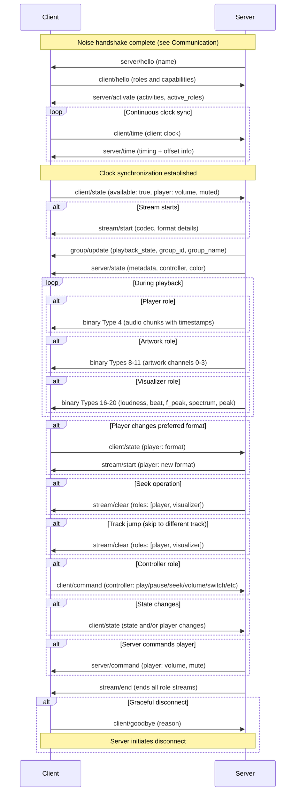

<!-- keep: the following comment is preserved verbatim as the generated-file banner at the top of README.md -->
<!--
  GENERATED FILE - do not edit directly.
  README.md is generated from the split spec source .md files.
  Edit those, not this file. Enable the pre-commit hook once with
  `git config core.hooksPath .githooks` to keep README.md up to date
  automatically. See CONTRIBUTING.md for details.
-->

# The Sendspin Protocol

Sendspin is a multi-room music experience protocol. The goal of the protocol is to orchestrate all devices that make up the music listening experience. This includes outputting audio on multiple speakers simultaneously, screens and lights visualizing the audio or album art, and wall tablets providing media controls.

## Normative Language

The key words "MUST", "MUST NOT", "REQUIRED", "SHALL", "SHALL NOT", "SHOULD", "SHOULD NOT", "RECOMMENDED", "NOT RECOMMENDED", "MAY", and "OPTIONAL" in this document are to be interpreted as described in BCP 14 [RFC 2119](https://www.rfc-editor.org/rfc/rfc2119) [RFC 8174](https://www.rfc-editor.org/rfc/rfc8174).

## Protocol overview

A typical session, from handshake through playback to disconnect:

## Definitions

- **Server** - orchestrates all devices, generates audio streams, manages players and clients, provides metadata
- **Client** - a device or application that can play audio, capture audio inputs, visualize audio, display metadata, display colors, or provide music controls. Has different possible roles (player, source, metadata, controller, artwork, visualizer, color). Every client has a unique identifier
  - **Player** - receives audio and plays it in sync. Has its own volume and mute state and preferred format settings
  - **Source** - captures audio from a local input and streams it to the server
  - **Controller** - controls the group this client is part of
  - **Metadata** - displays text metadata (title, artist, album, etc.)
  - **Artwork** - displays artwork images. Has preferred format for images
  - **Visualizer** - visualizes music. Has preferred format for audio features
  - **Color** - receives colors derived from the current audio
- **Group** - a group of clients. Each client belongs to exactly one group, and every group has at least one client. Every group has a unique identifier. Each group has the following states: list of member clients, volume, mute, and playback state
- **Stream** - client-specific details on how binary data is formatted and sent in either direction. Each role's stream is managed separately. For server-to-client streams, each client receives its own independently encoded stream based on its capabilities and preferences. For players, the server sends audio chunks as far ahead as the client's buffer capacity allows. For artwork clients, the server sends album artwork and other visual images through the stream
- **CSPRNG** - a cryptographically secure pseudorandom number generator seeded with sufficient entropy ([RFC 4086](https://www.rfc-editor.org/rfc/rfc4086)); a hardware RNG qualifies
- **Identity** - a Curve25519 keypair used to identify a client or server in the [Noise](connection.md#encryption) handshake. The base64url-encoded public key (43 characters, no padding) serves as the `client_id` or `server_id`. Persistent across reboots. The private key MUST be drawn from a CSPRNG.
- **long-term PSK** - a 32-byte pre-shared symmetric secret established during [pairing](pairing.md#pairing) and mixed into the [Noise](connection.md#encryption) handshake state for every subsequent connection. MUST be drawn from a CSPRNG.
- **pairing PSK** - a 32-byte symmetric secret used as the PSK in the [Pairing PSK method](pairing.md#pairing). It is always distributed alongside the client's static public key (`client_id`), which the server needs to verify the client identity. The operator enters it into the server as a [pairing token](pairing.md#pairing-token), copied as text or scanned as a QR code. Distinct from the long-term PSK that pairing produces. MUST be drawn from a CSPRNG.
- **Pairing Code** - a value used in code-based [pairing](pairing.md#pairing) methods. The static-pairing-code method uses a fixed 8-digit decimal value; the dynamic-pairing-code method uses a per-session generated value, emitted as a 6-digit decimal code or as a QR code (see [Dynamic Pairing Code Flow](pairing.md#dynamic-pairing-code-flow)).
- **Factory Reset** - returns a device to its manufactured state: credentials and settings the manufacturer provisioned (identity keypair, pairing PSK, static pairing code, a calibrated [output delay](roles/player/v1.md#client--server-clientstate-player-object)) are restored; everything accumulated since, pairing records included, is cleared.
- **Paired Session** - a session keyed by a long-term PSK, meaning the client holds a pairing record for the server. Sessions keyed by the pairing PSK or the Sentinel PSK are *unpaired*, which limits the server to a pairing exchange, or to normal playback and control flows where [unpaired access](pairing.md#unpaired-access) is enabled. Neither side sends this on the wire: both derive it from the PSK that matched during the [Noise](connection.md#encryption) handshake.

## Role Versioning

Roles define what capabilities and responsibilities a client has. All roles use explicit versioning with the `@` character: `<role>@<version>` (e.g., `player@v1`, `controller@v1`).

This specification defines the following roles: [`player`](roles/player/v1.md#player-messages), [`source`](roles/source/v1.md#source-messages), [`controller`](roles/controller/v1.md#controller-messages), [`metadata`](roles/metadata/v1.md#metadata-messages), [`artwork`](roles/artwork/v1.md#artwork-messages), [`visualizer`](roles/visualizer/v1.md#visualizer-messages), [`color`](roles/color/v1.md#color-messages). All servers must implement all versions of these roles described in this specification.

All role names and versions not starting with `_` are reserved for future revisions of this specification.

### Priority and Activation

Clients list roles in `supported_roles` in priority order (most preferred first). If a client supports multiple versions of a role, all should be listed: `["player@v2", "player@v1"]`.

The server activates at most one version per role family (e.g., one `player@vN`, one `controller@vN`) - the first match it implements from the client's list, or none if server policy declines to activate that family. A server MUST NOT activate a role or version the client did not list in `supported_roles`. The server reports activated roles in `active_roles`; clients MUST consult it and refrain from sending commands or state for roles that aren't active.

Message object keys (e.g., `player?`, `controller?`) use unversioned role names. The server determines the appropriate version from the client's `active_roles`.

### Detecting Outdated Servers

Servers should track when clients request roles or role versions they don't implement (excluding those starting with `_`). This indicates the client supports newer role versions than the server and the server needs to be updated.

This mechanism only detects role-version skew, and only because roles are exchanged after the handshake. A newer core `version`, cipher suite, or handshake (a cipher or handshake change is itself a core `version` bump) makes the [handshake](connection.md#failure-handling) abort before roles are exchanged, so that skew surfaces as a failed connection rather than through this role-request signal.

### Application-Specific Roles

Custom roles outside the specification start with `_` and MUST include an explicit version when advertised (e.g., `_myapp_controller@v1`, `_custom_display@v1`). To avoid collisions between independent vendors, custom role names SHOULD include a vendor-specific prefix (e.g., `_vendorname_role`).

Their binary message IDs come from the unmanaged 192-255 range: an application-specific role's own definition assigns its IDs, and a client MUST NOT advertise two roles with conflicting IDs.

<!-- include: connection.md -->
<!-- include: messaging.md -->
<!-- include: pairing.md -->
<!-- include: roles/player/v1.md -->
<!-- include: roles/source/v1.md -->
<!-- include: roles/controller/v1.md -->
<!-- include: roles/metadata/v1.md -->
<!-- include: roles/artwork/v1.md -->
<!-- include: roles/visualizer/v1.md -->
<!-- include: roles/color/v1.md -->
